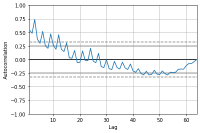
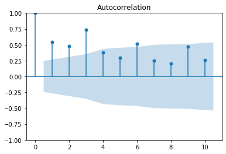
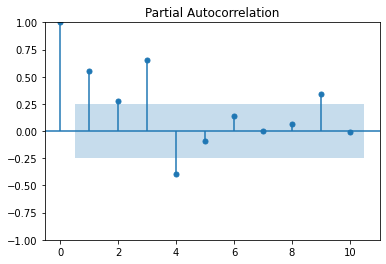

***

# Revenue Forecast using ARIMA

*Posted on April 2022*

***

In this notebook Im going to try forecast revenue using ARIMA model


```python
import warnings
import pandas as pd
import plotly.express as px

from pandas.plotting import autocorrelation_plot
from matplotlib import pyplot
from statsmodels.tsa.arima.model import ARIMA
from statsmodels.graphics.tsaplots import plot_acf
from statsmodels.graphics.tsaplots import plot_pacf
from sklearn.metrics import mean_squared_error
from math import sqrt
```


```python
path_file = '/kaggle/input/time-series-starter-dataset/Month_Value_1.csv'

df = pd.read_csv(path_file)
```


```python
df.dtypes
```


    Period                                       object
    Revenue                                     float64
    Sales_quantity                              float64
    Average_cost                                float64
    The_average_annual_payroll_of_the_region    float64
    dtype: object


```python
df['Period'] = pd.to_datetime(df['Period'], dayfirst=True)
```


```python
df = df.dropna()
```


```python
df.head()
```


<div>
<style scoped>
    .dataframe tbody tr th:only-of-type {
        vertical-align: middle;
    }

    .dataframe tbody tr th {
        vertical-align: top;
    }

    .dataframe thead th {
        text-align: right;
    }
</style>
<table border="1" class="dataframe">
  <thead>
    <tr style="text-align: right;">
      <th></th>
      <th>Period</th>
      <th>Revenue</th>
      <th>Sales_quantity</th>
      <th>Average_cost</th>
      <th>The_average_annual_payroll_of_the_region</th>
    </tr>
  </thead>
  <tbody>
    <tr>
      <th>0</th>
      <td>2015-01-01</td>
      <td>1.601007e+07</td>
      <td>12729.0</td>
      <td>1257.763541</td>
      <td>30024676.0</td>
    </tr>
    <tr>
      <th>1</th>
      <td>2015-02-01</td>
      <td>1.580759e+07</td>
      <td>11636.0</td>
      <td>1358.507000</td>
      <td>30024676.0</td>
    </tr>
    <tr>
      <th>2</th>
      <td>2015-03-01</td>
      <td>2.204715e+07</td>
      <td>15922.0</td>
      <td>1384.697024</td>
      <td>30024676.0</td>
    </tr>
    <tr>
      <th>3</th>
      <td>2015-04-01</td>
      <td>1.881458e+07</td>
      <td>15227.0</td>
      <td>1235.606705</td>
      <td>30024676.0</td>
    </tr>
    <tr>
      <th>4</th>
      <td>2015-05-01</td>
      <td>1.402148e+07</td>
      <td>8620.0</td>
      <td>1626.621765</td>
      <td>30024676.0</td>
    </tr>
  </tbody>
</table>
</div>


```python
fig = px.line(df, x='Period', y="Revenue")
fig.show()
```


<script type="text/javascript">
window.PlotlyConfig = {MathJaxConfig: 'local'};
if (window.MathJax) {MathJax.Hub.Config({SVG: {font: "STIX-Web"}});}
if (typeof require !== 'undefined') {
require.undef("plotly");
requirejs.config({
    paths: {
        'plotly': ['https://cdn.plot.ly/plotly-2.9.0.min']
    }
});
require(['plotly'], function(Plotly) {
    window._Plotly = Plotly;
});
}
</script>


<div>                            <div id="549c02d2-d615-40b7-9060-545b37bfaaed" class="plotly-graph-div" style="height:525px; width:100%;"></div>            <script type="text/javascript">                require(["plotly"], function(Plotly) {                    window.PLOTLYENV=window.PLOTLYENV || {};                                    if (document.getElementById("549c02d2-d615-40b7-9060-545b37bfaaed")) {                    Plotly.newPlot(                        "549c02d2-d615-40b7-9060-545b37bfaaed",                        [{"hovertemplate":"Period=%{x}<br>Revenue=%{y}<extra></extra>","legendgroup":"","line":{"color":"#636efa","dash":"solid"},"marker":{"symbol":"circle"},"mode":"lines","name":"","orientation":"v","showlegend":false,"x":["2015-01-01T00:00:00","2015-02-01T00:00:00","2015-03-01T00:00:00","2015-04-01T00:00:00","2015-05-01T00:00:00","2015-06-01T00:00:00","2015-07-01T00:00:00","2015-08-01T00:00:00","2015-09-01T00:00:00","2015-10-01T00:00:00","2015-11-01T00:00:00","2015-12-01T00:00:00","2016-01-01T00:00:00","2016-02-01T00:00:00","2016-03-01T00:00:00","2016-04-01T00:00:00","2016-05-01T00:00:00","2016-06-01T00:00:00","2016-07-01T00:00:00","2016-08-01T00:00:00","2016-09-01T00:00:00","2016-10-01T00:00:00","2016-11-01T00:00:00","2016-12-01T00:00:00","2017-01-01T00:00:00","2017-02-01T00:00:00","2017-03-01T00:00:00","2017-04-01T00:00:00","2017-05-01T00:00:00","2017-06-01T00:00:00","2017-07-01T00:00:00","2017-08-01T00:00:00","2017-09-01T00:00:00","2017-10-01T00:00:00","2017-11-01T00:00:00","2017-12-01T00:00:00","2018-01-01T00:00:00","2018-02-01T00:00:00","2018-03-01T00:00:00","2018-04-01T00:00:00","2018-05-01T00:00:00","2018-06-01T00:00:00","2018-07-01T00:00:00","2018-08-01T00:00:00","2018-09-01T00:00:00","2018-10-01T00:00:00","2018-11-01T00:00:00","2018-12-01T00:00:00","2019-01-01T00:00:00","2019-02-01T00:00:00","2019-03-01T00:00:00","2019-04-01T00:00:00","2019-05-01T00:00:00","2019-06-01T00:00:00","2019-07-01T00:00:00","2019-08-01T00:00:00","2019-09-01T00:00:00","2019-10-01T00:00:00","2019-11-01T00:00:00","2019-12-01T00:00:00","2020-01-01T00:00:00","2020-02-01T00:00:00","2020-03-01T00:00:00","2020-04-01T00:00:00"],"xaxis":"x","y":[16010072.1195,15807587.449808,22047146.023644,18814583.29428,14021479.611678,16783928.522112,19161892.194872,15204984.296742,20603939.9751,20992874.780136,14993369.65763,27791807.639848,28601586.496,22367074.065584,29738608.568,28351007.9388,15264603.734865,24385658.077056,29486517.069955,15270117.2565,36141027.562,27915143.655,21272049.3454,42014159.88396,36007380.67,30396775.3784,47678130.72603,27013964.728324,24948844.698,31101345.543,33848822.228544,16454666.958,31650092.652,31572205.6224,22446371.0268,44966125.7696,44067520.858,36020287.1553,46995990.4125,35536487.6848,29699599.176,33261065.3886,35826534.9072,23268655.2112,35423489.85,39831565.6974,32999145.2096,47221828.2018,36459960.091485,36546498.663015,54198706.7196,32743989.6056,32531657.5397,47709701.6346,45992141.57398,36933665.022,48526260.1344,44160416.1824,36374956.4944,58756473.6608,56288300.87,40225243.264,50022165.2325,52320692.9428],"yaxis":"y","type":"scatter"}],                        {"template":{"data":{"bar":[{"error_x":{"color":"#2a3f5f"},"error_y":{"color":"#2a3f5f"},"marker":{"line":{"color":"#E5ECF6","width":0.5},"pattern":{"fillmode":"overlay","size":10,"solidity":0.2}},"type":"bar"}],"barpolar":[{"marker":{"line":{"color":"#E5ECF6","width":0.5},"pattern":{"fillmode":"overlay","size":10,"solidity":0.2}},"type":"barpolar"}],"carpet":[{"aaxis":{"endlinecolor":"#2a3f5f","gridcolor":"white","linecolor":"white","minorgridcolor":"white","startlinecolor":"#2a3f5f"},"baxis":{"endlinecolor":"#2a3f5f","gridcolor":"white","linecolor":"white","minorgridcolor":"white","startlinecolor":"#2a3f5f"},"type":"carpet"}],"choropleth":[{"colorbar":{"outlinewidth":0,"ticks":""},"type":"choropleth"}],"contour":[{"colorbar":{"outlinewidth":0,"ticks":""},"colorscale":[[0.0,"#0d0887"],[0.1111111111111111,"#46039f"],[0.2222222222222222,"#7201a8"],[0.3333333333333333,"#9c179e"],[0.4444444444444444,"#bd3786"],[0.5555555555555556,"#d8576b"],[0.6666666666666666,"#ed7953"],[0.7777777777777778,"#fb9f3a"],[0.8888888888888888,"#fdca26"],[1.0,"#f0f921"]],"type":"contour"}],"contourcarpet":[{"colorbar":{"outlinewidth":0,"ticks":""},"type":"contourcarpet"}],"heatmap":[{"colorbar":{"outlinewidth":0,"ticks":""},"colorscale":[[0.0,"#0d0887"],[0.1111111111111111,"#46039f"],[0.2222222222222222,"#7201a8"],[0.3333333333333333,"#9c179e"],[0.4444444444444444,"#bd3786"],[0.5555555555555556,"#d8576b"],[0.6666666666666666,"#ed7953"],[0.7777777777777778,"#fb9f3a"],[0.8888888888888888,"#fdca26"],[1.0,"#f0f921"]],"type":"heatmap"}],"heatmapgl":[{"colorbar":{"outlinewidth":0,"ticks":""},"colorscale":[[0.0,"#0d0887"],[0.1111111111111111,"#46039f"],[0.2222222222222222,"#7201a8"],[0.3333333333333333,"#9c179e"],[0.4444444444444444,"#bd3786"],[0.5555555555555556,"#d8576b"],[0.6666666666666666,"#ed7953"],[0.7777777777777778,"#fb9f3a"],[0.8888888888888888,"#fdca26"],[1.0,"#f0f921"]],"type":"heatmapgl"}],"histogram":[{"marker":{"pattern":{"fillmode":"overlay","size":10,"solidity":0.2}},"type":"histogram"}],"histogram2d":[{"colorbar":{"outlinewidth":0,"ticks":""},"colorscale":[[0.0,"#0d0887"],[0.1111111111111111,"#46039f"],[0.2222222222222222,"#7201a8"],[0.3333333333333333,"#9c179e"],[0.4444444444444444,"#bd3786"],[0.5555555555555556,"#d8576b"],[0.6666666666666666,"#ed7953"],[0.7777777777777778,"#fb9f3a"],[0.8888888888888888,"#fdca26"],[1.0,"#f0f921"]],"type":"histogram2d"}],"histogram2dcontour":[{"colorbar":{"outlinewidth":0,"ticks":""},"colorscale":[[0.0,"#0d0887"],[0.1111111111111111,"#46039f"],[0.2222222222222222,"#7201a8"],[0.3333333333333333,"#9c179e"],[0.4444444444444444,"#bd3786"],[0.5555555555555556,"#d8576b"],[0.6666666666666666,"#ed7953"],[0.7777777777777778,"#fb9f3a"],[0.8888888888888888,"#fdca26"],[1.0,"#f0f921"]],"type":"histogram2dcontour"}],"mesh3d":[{"colorbar":{"outlinewidth":0,"ticks":""},"type":"mesh3d"}],"parcoords":[{"line":{"colorbar":{"outlinewidth":0,"ticks":""}},"type":"parcoords"}],"pie":[{"automargin":true,"type":"pie"}],"scatter":[{"marker":{"colorbar":{"outlinewidth":0,"ticks":""}},"type":"scatter"}],"scatter3d":[{"line":{"colorbar":{"outlinewidth":0,"ticks":""}},"marker":{"colorbar":{"outlinewidth":0,"ticks":""}},"type":"scatter3d"}],"scattercarpet":[{"marker":{"colorbar":{"outlinewidth":0,"ticks":""}},"type":"scattercarpet"}],"scattergeo":[{"marker":{"colorbar":{"outlinewidth":0,"ticks":""}},"type":"scattergeo"}],"scattergl":[{"marker":{"colorbar":{"outlinewidth":0,"ticks":""}},"type":"scattergl"}],"scattermapbox":[{"marker":{"colorbar":{"outlinewidth":0,"ticks":""}},"type":"scattermapbox"}],"scatterpolar":[{"marker":{"colorbar":{"outlinewidth":0,"ticks":""}},"type":"scatterpolar"}],"scatterpolargl":[{"marker":{"colorbar":{"outlinewidth":0,"ticks":""}},"type":"scatterpolargl"}],"scatterternary":[{"marker":{"colorbar":{"outlinewidth":0,"ticks":""}},"type":"scatterternary"}],"surface":[{"colorbar":{"outlinewidth":0,"ticks":""},"colorscale":[[0.0,"#0d0887"],[0.1111111111111111,"#46039f"],[0.2222222222222222,"#7201a8"],[0.3333333333333333,"#9c179e"],[0.4444444444444444,"#bd3786"],[0.5555555555555556,"#d8576b"],[0.6666666666666666,"#ed7953"],[0.7777777777777778,"#fb9f3a"],[0.8888888888888888,"#fdca26"],[1.0,"#f0f921"]],"type":"surface"}],"table":[{"cells":{"fill":{"color":"#EBF0F8"},"line":{"color":"white"}},"header":{"fill":{"color":"#C8D4E3"},"line":{"color":"white"}},"type":"table"}]},"layout":{"annotationdefaults":{"arrowcolor":"#2a3f5f","arrowhead":0,"arrowwidth":1},"autotypenumbers":"strict","coloraxis":{"colorbar":{"outlinewidth":0,"ticks":""}},"colorscale":{"diverging":[[0,"#8e0152"],[0.1,"#c51b7d"],[0.2,"#de77ae"],[0.3,"#f1b6da"],[0.4,"#fde0ef"],[0.5,"#f7f7f7"],[0.6,"#e6f5d0"],[0.7,"#b8e186"],[0.8,"#7fbc41"],[0.9,"#4d9221"],[1,"#276419"]],"sequential":[[0.0,"#0d0887"],[0.1111111111111111,"#46039f"],[0.2222222222222222,"#7201a8"],[0.3333333333333333,"#9c179e"],[0.4444444444444444,"#bd3786"],[0.5555555555555556,"#d8576b"],[0.6666666666666666,"#ed7953"],[0.7777777777777778,"#fb9f3a"],[0.8888888888888888,"#fdca26"],[1.0,"#f0f921"]],"sequentialminus":[[0.0,"#0d0887"],[0.1111111111111111,"#46039f"],[0.2222222222222222,"#7201a8"],[0.3333333333333333,"#9c179e"],[0.4444444444444444,"#bd3786"],[0.5555555555555556,"#d8576b"],[0.6666666666666666,"#ed7953"],[0.7777777777777778,"#fb9f3a"],[0.8888888888888888,"#fdca26"],[1.0,"#f0f921"]]},"colorway":["#636efa","#EF553B","#00cc96","#ab63fa","#FFA15A","#19d3f3","#FF6692","#B6E880","#FF97FF","#FECB52"],"font":{"color":"#2a3f5f"},"geo":{"bgcolor":"white","lakecolor":"white","landcolor":"#E5ECF6","showlakes":true,"showland":true,"subunitcolor":"white"},"hoverlabel":{"align":"left"},"hovermode":"closest","mapbox":{"style":"light"},"paper_bgcolor":"white","plot_bgcolor":"#E5ECF6","polar":{"angularaxis":{"gridcolor":"white","linecolor":"white","ticks":""},"bgcolor":"#E5ECF6","radialaxis":{"gridcolor":"white","linecolor":"white","ticks":""}},"scene":{"xaxis":{"backgroundcolor":"#E5ECF6","gridcolor":"white","gridwidth":2,"linecolor":"white","showbackground":true,"ticks":"","zerolinecolor":"white"},"yaxis":{"backgroundcolor":"#E5ECF6","gridcolor":"white","gridwidth":2,"linecolor":"white","showbackground":true,"ticks":"","zerolinecolor":"white"},"zaxis":{"backgroundcolor":"#E5ECF6","gridcolor":"white","gridwidth":2,"linecolor":"white","showbackground":true,"ticks":"","zerolinecolor":"white"}},"shapedefaults":{"line":{"color":"#2a3f5f"}},"ternary":{"aaxis":{"gridcolor":"white","linecolor":"white","ticks":""},"baxis":{"gridcolor":"white","linecolor":"white","ticks":""},"bgcolor":"#E5ECF6","caxis":{"gridcolor":"white","linecolor":"white","ticks":""}},"title":{"x":0.05},"xaxis":{"automargin":true,"gridcolor":"white","linecolor":"white","ticks":"","title":{"standoff":15},"zerolinecolor":"white","zerolinewidth":2},"yaxis":{"automargin":true,"gridcolor":"white","linecolor":"white","ticks":"","title":{"standoff":15},"zerolinecolor":"white","zerolinewidth":2}}},"xaxis":{"anchor":"y","domain":[0.0,1.0],"title":{"text":"Period"}},"yaxis":{"anchor":"x","domain":[0.0,1.0],"title":{"text":"Revenue"}},"legend":{"tracegroupgap":0},"margin":{"t":60}},                        {"responsive": true}                    ).then(function(){

var gd = document.getElementById('549c02d2-d615-40b7-9060-545b37bfaaed');
var x = new MutationObserver(function (mutations, observer) {{
        var display = window.getComputedStyle(gd).display;
        if (!display || display === 'none') {{
            console.log([gd, 'removed!']);
            Plotly.purge(gd);
            observer.disconnect();
        }}
}});

// Listen for the removal of the full notebook cells
var notebookContainer = gd.closest('#notebook-container');
if (notebookContainer) {{
    x.observe(notebookContainer, {childList: true});
}}

// Listen for the clearing of the current output cell
var outputEl = gd.closest('.output');
if (outputEl) {{
    x.observe(outputEl, {childList: true});
}}

                        })                };                });            </script>        </div>


```python
series = pd.Series(df['Revenue'])
series.head()
```


    0    1.601007e+07
    1    1.580759e+07
    2    2.204715e+07
    3    1.881458e+07
    4    1.402148e+07
    Name: Revenue, dtype: float64


## Autocorrelation Function and Partial Autocorrelation Function


```python
autocorrelation_plot(series)
pyplot.show()
```


    

    


Looks like there are correlation at the first 10 lag


```python
plot_acf(series, lags=10)
pyplot.show()
```


    

    


```python
plot_pacf(series, lags=10)
pyplot.show()
```

    /opt/conda/lib/python3.7/site-packages/statsmodels/graphics/tsaplots.py:353: FutureWarning:
    
    The default method 'yw' can produce PACF values outside of the [-1,1] interval. After 0.13, the default will change tounadjusted Yule-Walker ('ywm'). You can use this method now by setting method='ywm'.
    
    


    

    


## Base model

Base model with the next prediction is the same as current observastion


```python
X = series.values
size = int(len(X) * 0.66)
train, test = X[0:size], X[size:len(X)]
history = [x for x in train]
predictions = list()
```


```python

warnings.filterwarnings('ignore')
for t in range(len(test)):
    #model = ARIMA(history, order=(1,1,1))
    #model_fit = model.fit()
    #output = model_fit.forecast()
    yhat = test[t-1]
    predictions.append(yhat)
    obs = test[t]
    history.append(obs)
    
    print("predicted: {}, expected: {}".format(yhat, obs))
    
rmse = sqrt(mean_squared_error(test, predictions))
print("Test RMSE: {}".format(rmse))
```

    predicted: 52320692.9428, expected: 35826534.9072
    predicted: 35826534.9072, expected: 23268655.2112
    predicted: 23268655.2112, expected: 35423489.85
    predicted: 35423489.85, expected: 39831565.6974
    predicted: 39831565.6974, expected: 32999145.2096
    predicted: 32999145.2096, expected: 47221828.2018
    predicted: 47221828.2018, expected: 36459960.091485
    predicted: 36459960.091485, expected: 36546498.663015
    predicted: 36546498.663015, expected: 54198706.7196
    predicted: 54198706.7196, expected: 32743989.6056
    predicted: 32743989.6056, expected: 32531657.5397
    predicted: 32531657.5397, expected: 47709701.6346
    predicted: 47709701.6346, expected: 45992141.57398
    predicted: 45992141.57398, expected: 36933665.022
    predicted: 36933665.022, expected: 48526260.1344
    predicted: 48526260.1344, expected: 44160416.1824
    predicted: 44160416.1824, expected: 36374956.4944
    predicted: 36374956.4944, expected: 58756473.6608
    predicted: 58756473.6608, expected: 56288300.87
    predicted: 56288300.87, expected: 40225243.264
    predicted: 40225243.264, expected: 50022165.2325
    predicted: 50022165.2325, expected: 52320692.9428
    Test RMSE: 11926710.49753097
    


```python
df_plot = pd.DataFrame(data={'Test': test, 'Base Model Predictions': predictions})

fig = px.line(df_plot, x=df_plot.index, y=df_plot.columns)
fig.show()
```


<div>                            <div id="0f11afea-4a56-4953-9213-252c39552c56" class="plotly-graph-div" style="height:525px; width:100%;"></div>            <script type="text/javascript">                require(["plotly"], function(Plotly) {                    window.PLOTLYENV=window.PLOTLYENV || {};                                    if (document.getElementById("0f11afea-4a56-4953-9213-252c39552c56")) {                    Plotly.newPlot(                        "0f11afea-4a56-4953-9213-252c39552c56",                        [{"hovertemplate":"variable=Test<br>index=%{x}<br>value=%{y}<extra></extra>","legendgroup":"Test","line":{"color":"#636efa","dash":"solid"},"marker":{"symbol":"circle"},"mode":"lines","name":"Test","orientation":"v","showlegend":true,"x":[0,1,2,3,4,5,6,7,8,9,10,11,12,13,14,15,16,17,18,19,20,21],"xaxis":"x","y":[35826534.9072,23268655.2112,35423489.85,39831565.6974,32999145.2096,47221828.2018,36459960.091485,36546498.663015,54198706.7196,32743989.6056,32531657.5397,47709701.6346,45992141.57398,36933665.022,48526260.1344,44160416.1824,36374956.4944,58756473.6608,56288300.87,40225243.264,50022165.2325,52320692.9428],"yaxis":"y","type":"scatter"},{"hovertemplate":"variable=Base Model Predictions<br>index=%{x}<br>value=%{y}<extra></extra>","legendgroup":"Base Model Predictions","line":{"color":"#EF553B","dash":"solid"},"marker":{"symbol":"circle"},"mode":"lines","name":"Base Model Predictions","orientation":"v","showlegend":true,"x":[0,1,2,3,4,5,6,7,8,9,10,11,12,13,14,15,16,17,18,19,20,21],"xaxis":"x","y":[52320692.9428,35826534.9072,23268655.2112,35423489.85,39831565.6974,32999145.2096,47221828.2018,36459960.091485,36546498.663015,54198706.7196,32743989.6056,32531657.5397,47709701.6346,45992141.57398,36933665.022,48526260.1344,44160416.1824,36374956.4944,58756473.6608,56288300.87,40225243.264,50022165.2325],"yaxis":"y","type":"scatter"}],                        {"template":{"data":{"bar":[{"error_x":{"color":"#2a3f5f"},"error_y":{"color":"#2a3f5f"},"marker":{"line":{"color":"#E5ECF6","width":0.5},"pattern":{"fillmode":"overlay","size":10,"solidity":0.2}},"type":"bar"}],"barpolar":[{"marker":{"line":{"color":"#E5ECF6","width":0.5},"pattern":{"fillmode":"overlay","size":10,"solidity":0.2}},"type":"barpolar"}],"carpet":[{"aaxis":{"endlinecolor":"#2a3f5f","gridcolor":"white","linecolor":"white","minorgridcolor":"white","startlinecolor":"#2a3f5f"},"baxis":{"endlinecolor":"#2a3f5f","gridcolor":"white","linecolor":"white","minorgridcolor":"white","startlinecolor":"#2a3f5f"},"type":"carpet"}],"choropleth":[{"colorbar":{"outlinewidth":0,"ticks":""},"type":"choropleth"}],"contour":[{"colorbar":{"outlinewidth":0,"ticks":""},"colorscale":[[0.0,"#0d0887"],[0.1111111111111111,"#46039f"],[0.2222222222222222,"#7201a8"],[0.3333333333333333,"#9c179e"],[0.4444444444444444,"#bd3786"],[0.5555555555555556,"#d8576b"],[0.6666666666666666,"#ed7953"],[0.7777777777777778,"#fb9f3a"],[0.8888888888888888,"#fdca26"],[1.0,"#f0f921"]],"type":"contour"}],"contourcarpet":[{"colorbar":{"outlinewidth":0,"ticks":""},"type":"contourcarpet"}],"heatmap":[{"colorbar":{"outlinewidth":0,"ticks":""},"colorscale":[[0.0,"#0d0887"],[0.1111111111111111,"#46039f"],[0.2222222222222222,"#7201a8"],[0.3333333333333333,"#9c179e"],[0.4444444444444444,"#bd3786"],[0.5555555555555556,"#d8576b"],[0.6666666666666666,"#ed7953"],[0.7777777777777778,"#fb9f3a"],[0.8888888888888888,"#fdca26"],[1.0,"#f0f921"]],"type":"heatmap"}],"heatmapgl":[{"colorbar":{"outlinewidth":0,"ticks":""},"colorscale":[[0.0,"#0d0887"],[0.1111111111111111,"#46039f"],[0.2222222222222222,"#7201a8"],[0.3333333333333333,"#9c179e"],[0.4444444444444444,"#bd3786"],[0.5555555555555556,"#d8576b"],[0.6666666666666666,"#ed7953"],[0.7777777777777778,"#fb9f3a"],[0.8888888888888888,"#fdca26"],[1.0,"#f0f921"]],"type":"heatmapgl"}],"histogram":[{"marker":{"pattern":{"fillmode":"overlay","size":10,"solidity":0.2}},"type":"histogram"}],"histogram2d":[{"colorbar":{"outlinewidth":0,"ticks":""},"colorscale":[[0.0,"#0d0887"],[0.1111111111111111,"#46039f"],[0.2222222222222222,"#7201a8"],[0.3333333333333333,"#9c179e"],[0.4444444444444444,"#bd3786"],[0.5555555555555556,"#d8576b"],[0.6666666666666666,"#ed7953"],[0.7777777777777778,"#fb9f3a"],[0.8888888888888888,"#fdca26"],[1.0,"#f0f921"]],"type":"histogram2d"}],"histogram2dcontour":[{"colorbar":{"outlinewidth":0,"ticks":""},"colorscale":[[0.0,"#0d0887"],[0.1111111111111111,"#46039f"],[0.2222222222222222,"#7201a8"],[0.3333333333333333,"#9c179e"],[0.4444444444444444,"#bd3786"],[0.5555555555555556,"#d8576b"],[0.6666666666666666,"#ed7953"],[0.7777777777777778,"#fb9f3a"],[0.8888888888888888,"#fdca26"],[1.0,"#f0f921"]],"type":"histogram2dcontour"}],"mesh3d":[{"colorbar":{"outlinewidth":0,"ticks":""},"type":"mesh3d"}],"parcoords":[{"line":{"colorbar":{"outlinewidth":0,"ticks":""}},"type":"parcoords"}],"pie":[{"automargin":true,"type":"pie"}],"scatter":[{"marker":{"colorbar":{"outlinewidth":0,"ticks":""}},"type":"scatter"}],"scatter3d":[{"line":{"colorbar":{"outlinewidth":0,"ticks":""}},"marker":{"colorbar":{"outlinewidth":0,"ticks":""}},"type":"scatter3d"}],"scattercarpet":[{"marker":{"colorbar":{"outlinewidth":0,"ticks":""}},"type":"scattercarpet"}],"scattergeo":[{"marker":{"colorbar":{"outlinewidth":0,"ticks":""}},"type":"scattergeo"}],"scattergl":[{"marker":{"colorbar":{"outlinewidth":0,"ticks":""}},"type":"scattergl"}],"scattermapbox":[{"marker":{"colorbar":{"outlinewidth":0,"ticks":""}},"type":"scattermapbox"}],"scatterpolar":[{"marker":{"colorbar":{"outlinewidth":0,"ticks":""}},"type":"scatterpolar"}],"scatterpolargl":[{"marker":{"colorbar":{"outlinewidth":0,"ticks":""}},"type":"scatterpolargl"}],"scatterternary":[{"marker":{"colorbar":{"outlinewidth":0,"ticks":""}},"type":"scatterternary"}],"surface":[{"colorbar":{"outlinewidth":0,"ticks":""},"colorscale":[[0.0,"#0d0887"],[0.1111111111111111,"#46039f"],[0.2222222222222222,"#7201a8"],[0.3333333333333333,"#9c179e"],[0.4444444444444444,"#bd3786"],[0.5555555555555556,"#d8576b"],[0.6666666666666666,"#ed7953"],[0.7777777777777778,"#fb9f3a"],[0.8888888888888888,"#fdca26"],[1.0,"#f0f921"]],"type":"surface"}],"table":[{"cells":{"fill":{"color":"#EBF0F8"},"line":{"color":"white"}},"header":{"fill":{"color":"#C8D4E3"},"line":{"color":"white"}},"type":"table"}]},"layout":{"annotationdefaults":{"arrowcolor":"#2a3f5f","arrowhead":0,"arrowwidth":1},"autotypenumbers":"strict","coloraxis":{"colorbar":{"outlinewidth":0,"ticks":""}},"colorscale":{"diverging":[[0,"#8e0152"],[0.1,"#c51b7d"],[0.2,"#de77ae"],[0.3,"#f1b6da"],[0.4,"#fde0ef"],[0.5,"#f7f7f7"],[0.6,"#e6f5d0"],[0.7,"#b8e186"],[0.8,"#7fbc41"],[0.9,"#4d9221"],[1,"#276419"]],"sequential":[[0.0,"#0d0887"],[0.1111111111111111,"#46039f"],[0.2222222222222222,"#7201a8"],[0.3333333333333333,"#9c179e"],[0.4444444444444444,"#bd3786"],[0.5555555555555556,"#d8576b"],[0.6666666666666666,"#ed7953"],[0.7777777777777778,"#fb9f3a"],[0.8888888888888888,"#fdca26"],[1.0,"#f0f921"]],"sequentialminus":[[0.0,"#0d0887"],[0.1111111111111111,"#46039f"],[0.2222222222222222,"#7201a8"],[0.3333333333333333,"#9c179e"],[0.4444444444444444,"#bd3786"],[0.5555555555555556,"#d8576b"],[0.6666666666666666,"#ed7953"],[0.7777777777777778,"#fb9f3a"],[0.8888888888888888,"#fdca26"],[1.0,"#f0f921"]]},"colorway":["#636efa","#EF553B","#00cc96","#ab63fa","#FFA15A","#19d3f3","#FF6692","#B6E880","#FF97FF","#FECB52"],"font":{"color":"#2a3f5f"},"geo":{"bgcolor":"white","lakecolor":"white","landcolor":"#E5ECF6","showlakes":true,"showland":true,"subunitcolor":"white"},"hoverlabel":{"align":"left"},"hovermode":"closest","mapbox":{"style":"light"},"paper_bgcolor":"white","plot_bgcolor":"#E5ECF6","polar":{"angularaxis":{"gridcolor":"white","linecolor":"white","ticks":""},"bgcolor":"#E5ECF6","radialaxis":{"gridcolor":"white","linecolor":"white","ticks":""}},"scene":{"xaxis":{"backgroundcolor":"#E5ECF6","gridcolor":"white","gridwidth":2,"linecolor":"white","showbackground":true,"ticks":"","zerolinecolor":"white"},"yaxis":{"backgroundcolor":"#E5ECF6","gridcolor":"white","gridwidth":2,"linecolor":"white","showbackground":true,"ticks":"","zerolinecolor":"white"},"zaxis":{"backgroundcolor":"#E5ECF6","gridcolor":"white","gridwidth":2,"linecolor":"white","showbackground":true,"ticks":"","zerolinecolor":"white"}},"shapedefaults":{"line":{"color":"#2a3f5f"}},"ternary":{"aaxis":{"gridcolor":"white","linecolor":"white","ticks":""},"baxis":{"gridcolor":"white","linecolor":"white","ticks":""},"bgcolor":"#E5ECF6","caxis":{"gridcolor":"white","linecolor":"white","ticks":""}},"title":{"x":0.05},"xaxis":{"automargin":true,"gridcolor":"white","linecolor":"white","ticks":"","title":{"standoff":15},"zerolinecolor":"white","zerolinewidth":2},"yaxis":{"automargin":true,"gridcolor":"white","linecolor":"white","ticks":"","title":{"standoff":15},"zerolinecolor":"white","zerolinewidth":2}}},"xaxis":{"anchor":"y","domain":[0.0,1.0],"title":{"text":"index"}},"yaxis":{"anchor":"x","domain":[0.0,1.0],"title":{"text":"value"}},"legend":{"title":{"text":"variable"},"tracegroupgap":0},"margin":{"t":60}},                        {"responsive": true}                    ).then(function(){

var gd = document.getElementById('0f11afea-4a56-4953-9213-252c39552c56');
var x = new MutationObserver(function (mutations, observer) {{
        var display = window.getComputedStyle(gd).display;
        if (!display || display === 'none') {{
            console.log([gd, 'removed!']);
            Plotly.purge(gd);
            observer.disconnect();
        }}
}});

// Listen for the removal of the full notebook cells
var notebookContainer = gd.closest('#notebook-container');
if (notebookContainer) {{
    x.observe(notebookContainer, {childList: true});
}}

// Listen for the clearing of the current output cell
var outputEl = gd.closest('.output');
if (outputEl) {{
    x.observe(outputEl, {childList: true});
}}

                        })                };                });            </script>        </div>


## Gridsearch

Next, Im going to use gridsearch to find the best parameters for the ARIMA model


```python

def evaluate_arima(X, order):
    size = int(len(X) * 0.66)
    train, test = X[0:size], X[size:len(X)]
    history = [x for x in train]
    predictions = list()
    
    for t in range(len(test)):
        model = ARIMA(history, order=order)
        model_fit = model.fit()
        output = model_fit.forecast()
        yhat = output[0]
        predictions.append(yhat)
        obs = test[t]
        history.append(obs)
    
        print("predicted: {}, expected: {}".format(yhat, obs))
    
    rmse = sqrt(mean_squared_error(test, predictions))
    return rmse

def evaluate_model(dataset, ps, ds, qs):
    best_score, best_order = float('inf'), None
    
    for p in ps:
        for d in ds:
            for q in qs:
                
                order = (p,d,q)
                
                try:
                    rmse = evaluate_arima(dataset, order)
                    if rmse < best_score:
                        best_score, best_order = rmse, order
                
                    print('ARIMA {}, RMSE: {}'.format(rmse, order))
                except:
                    continue
                    
    print('Best ARIMA {}, RMSE: {}'.format(best_score, best_order))
```


```python
ps = [0, 2, 4, 8, 10]
ds = [0, 2, 4, 8]
qs = [0, 2, 4, 8]

warnings.filterwarnings('ignore')
evaluate_model(series.values, ps, ds, qs)
```

    predicted: 27302545.140351605, expected: 35826534.9072
    predicted: 27500777.460510895, expected: 23268655.2112
    predicted: 27404592.86393564, expected: 35423489.85
    predicted: 27582790.574737072, expected: 39831565.6974
    predicted: 27849068.294794958, expected: 32999145.2096
    predicted: 27958644.39936528, expected: 47221828.2018
    predicted: 28359960.728582677, expected: 36459960.091485
    predicted: 28525266.83802965, expected: 36546498.663015
    predicted: 28685691.47452936, expected: 54198706.7196
    predicted: 29185946.675413094, expected: 32743989.6056
    predicted: 29254370.57791669, expected: 32531657.5397
    predicted: 29316206.180969212, expected: 47709701.6346
    predicted: 29656826.467147563, expected: 45992141.57398
    predicted: 29953832.196362693, expected: 36933665.022
    predicted: 30078472.068249073, expected: 48526260.1344
    predicted: 30402117.47291839, expected: 44160416.1824
    predicted: 30639329.51963358, expected: 36374956.4944
    predicted: 30736543.53615504, expected: 58756473.6608
    predicted: 31203542.3715658, expected: 56288300.87
    predicted: 31614767.920720465, expected: 40225243.264
    predicted: 31753646.55528949, expected: 50022165.2325
    predicted: 32043623.042229336, expected: 52320692.9428
    ARIMA 15009925.416606726, RMSE: (0, 0, 0)
    predicted: 24521428.741973735, expected: 35826534.9072
    predicted: 25645236.764643814, expected: 23268655.2112
    predicted: 38039343.96719576, expected: 35423489.85
    predicted: 25809144.327008806, expected: 39831565.6974
    predicted: 23074477.64562048, expected: 32999145.2096
    predicted: 37755888.20499143, expected: 47221828.2018
    predicted: 35430322.31341398, expected: 36459960.091485
    predicted: 35378419.306658156, expected: 36546498.663015
    predicted: 29017270.441735998, expected: 54198706.7196
    predicted: 25149190.282426924, expected: 32743989.6056
    predicted: 47259983.153859906, expected: 32531657.5397
    predicted: 36272437.143247746, expected: 47709701.6346
    predicted: 17571158.560217865, expected: 45992141.57398
    predicted: 34411940.426636316, expected: 36933665.022
    predicted: 30871300.353678726, expected: 48526260.1344
    predicted: 31908709.007657282, expected: 44160416.1824
    predicted: 28791306.25238744, expected: 36374956.4944
    predicted: 35761178.91448059, expected: 58756473.6608
    predicted: 32361625.829353813, expected: 56288300.87
    predicted: 36649144.11140952, expected: 40225243.264
    predicted: 33710116.57724345, expected: 50022165.2325
    predicted: 30030688.252223432, expected: 52320692.9428
    ARIMA 14736137.727122083, RMSE: (0, 0, 2)
    predicted: 28475923.352157332, expected: 35826534.9072
    predicted: 30265778.361048315, expected: 23268655.2112
    predicted: 29132684.464222293, expected: 35423489.85
    predicted: 30227470.255906682, expected: 39831565.6974
    predicted: 28866753.262801804, expected: 32999145.2096
    predicted: 37489569.035091154, expected: 47221828.2018
    predicted: 38083960.10672337, expected: 36459960.091485
    predicted: 34376861.67853649, expected: 36546498.663015
    predicted: 34105576.45649131, expected: 54198706.7196
    predicted: 34710202.81139118, expected: 32743989.6056
    predicted: 40323535.79864693, expected: 32531657.5397
    predicted: 38894810.76137849, expected: 47709701.6346
    predicted: 28248557.710518785, expected: 45992141.57398
    predicted: 35865874.65689446, expected: 36933665.022
    predicted: 39492745.9104635, expected: 48526260.1344
    predicted: 43536174.23616287, expected: 44160416.1824
    predicted: 35676020.724221915, expected: 36374956.4944
    predicted: 36239660.25614203, expected: 58756473.6608
    predicted: 40651569.5926557, expected: 56288300.87
    predicted: 43478917.109850064, expected: 40225243.264
    predicted: 43853574.471712805, expected: 50022165.2325
    predicted: 46344959.50537172, expected: 52320692.9428
    ARIMA 9849496.854367837, RMSE: (0, 0, 4)
    predicted: 26500710.895034283, expected: 35826534.9072
    predicted: 27856634.59601587, expected: 23268655.2112
    predicted: 28286275.931209486, expected: 35423489.85
    predicted: 31762115.594733182, expected: 39831565.6974
    predicted: 27106063.195852958, expected: 32999145.2096
    predicted: 41584582.40057176, expected: 47221828.2018
    predicted: 43863641.536987975, expected: 36459960.091485
    predicted: 35403955.24250698, expected: 36546498.663015
    predicted: 38790685.97308969, expected: 54198706.7196
    predicted: 35054826.802322924, expected: 32743989.6056
    predicted: 39825777.39450962, expected: 32531657.5397
    predicted: 40345155.48325815, expected: 47709701.6346
    predicted: 29106318.037463058, expected: 45992141.57398
    predicted: 36664722.07233035, expected: 36933665.022
    predicted: 44026281.10066988, expected: 48526260.1344
    predicted: 46545171.051195174, expected: 44160416.1824
    predicted: 35573958.60393682, expected: 36374956.4944
    predicted: 41071284.3596683, expected: 58756473.6608
    predicted: 42712277.138282, expected: 56288300.87
    predicted: 41102469.01869481, expected: 40225243.264
    predicted: 51436209.07943572, expected: 50022165.2325
    predicted: 45437012.92258155, expected: 52320692.9428
    ARIMA 8409684.13789329, RMSE: (0, 0, 8)
    predicted: 36822531.6012, expected: 35826534.9072
    predicted: 38392004.4258, expected: 23268655.2112
    predicted: 10710775.515199997, expected: 35423489.85
    predicted: 47578324.488800004, expected: 39831565.6974
    predicted: 44239641.544800006, expected: 32999145.2096
    predicted: 26166724.721800003, expected: 47221828.2018
    predicted: 61444511.194000006, expected: 36459960.091485
    predicted: 25698091.981170006, expected: 36546498.663015
    predicted: 36633037.234545, expected: 54198706.7196
    predicted: 71850914.77618499, expected: 32743989.6056
    predicted: 11289272.491599996, expected: 32531657.5397
    predicted: 32319325.47380003, expected: 47709701.6346
    predicted: 62887745.729499996, expected: 45992141.57398
    predicted: 44274581.51336001, expected: 36933665.022
    predicted: 27875188.470020015, expected: 48526260.1344
    predicted: 60118855.24679999, expected: 44160416.1824
    predicted: 39794572.23040001, expected: 36374956.4944
    predicted: 28589496.80640001, expected: 58756473.6608
    predicted: 81137990.8272, expected: 56288300.87
    predicted: 53820128.0792, expected: 40225243.264
    predicted: 24162185.65799998, expected: 50022165.2325
    predicted: 59819087.20100001, expected: 52320692.9428
    ARIMA 19315030.37826236, RMSE: (0, 2, 0)
    predicted: 19603212.573375776, expected: 35826534.9072
    predicted: 35972153.26532356, expected: 23268655.2112
    predicted: 22253835.236336105, expected: 35423489.85
    predicted: 31513256.466323845, expected: 39831565.6974
    predicted: 44125263.164621636, expected: 32999145.2096
    predicted: 43636029.41035017, expected: 47221828.2018
    predicted: 50737099.93823076, expected: 36459960.091485
    predicted: 45184079.15199746, expected: 36546498.663015
    predicted: 35807671.979135886, expected: 54198706.7196
    predicted: 44993973.39909233, expected: 32743989.6056
    predicted: 38041176.06512013, expected: 32531657.5397
    predicted: 38805491.73203048, expected: 47709701.6346
    predicted: 41812392.85054022, expected: 45992141.57398
    predicted: 43449718.51482757, expected: 36933665.022
    predicted: 42243410.397168204, expected: 48526260.1344
    predicted: 44320454.78037132, expected: 44160416.1824
    predicted: 44932724.411442, expected: 36374956.4944
    predicted: 43374386.689900205, expected: 58756473.6608
    predicted: 47594540.07115098, expected: 56288300.87
    predicted: 50916510.912243694, expected: 40225243.264
    predicted: 49213989.97963318, expected: 50022165.2325
    predicted: 50203577.26326686, expected: 52320692.9428
    ARIMA 10190296.560973927, RMSE: (0, 2, 2)
    predicted: 26477426.64447932, expected: 35826534.9072
    predicted: 27921398.858160883, expected: 23268655.2112
    predicted: 22961854.728406888, expected: 35423489.85
    predicted: 34502108.68871267, expected: 39831565.6974
    predicted: 36277382.26159441, expected: 32999145.2096
    predicted: 39898330.784826174, expected: 47221828.2018
    predicted: 47979665.13172625, expected: 36459960.091485
    predicted: 40024080.13047163, expected: 36546498.663015
    predicted: 41717166.83813224, expected: 54198706.7196
    predicted: 45375675.34298894, expected: 32743989.6056
    predicted: 35672176.652685985, expected: 32531657.5397
    predicted: 40496500.5305716, expected: 47709701.6346
    predicted: 39509576.15132122, expected: 45992141.57398
    predicted: 42196086.91681324, expected: 36933665.022
    predicted: 43089802.0021023, expected: 48526260.1344
    predicted: 50605904.54459717, expected: 44160416.1824
    predicted: 44829468.41163383, expected: 36374956.4944
    predicted: 43347288.627022944, expected: 58756473.6608
    predicted: 49762103.72270765, expected: 56288300.87
    predicted: 49455063.010159075, expected: 40225243.264
    predicted: 52545166.679102436, expected: 50022165.2325
    predicted: 56061968.3560459, expected: 52320692.9428
    ARIMA 8193816.360290468, RMSE: (0, 2, 4)
    predicted: 26068813.492214028, expected: 35826534.9072
    predicted: 30360146.5884623, expected: 23268655.2112
    predicted: 28524889.124920722, expected: 35423489.85
    predicted: 34027138.22746573, expected: 39831565.6974
    predicted: 32162646.93517234, expected: 32999145.2096
    predicted: 42311021.370860904, expected: 47221828.2018
    predicted: 47501569.397946715, expected: 36459960.091485
    predicted: 37350690.62875673, expected: 36546498.663015
    predicted: 40851881.365843914, expected: 54198706.7196
    predicted: 40411609.83938414, expected: 32743989.6056
    predicted: 41926983.732027724, expected: 32531657.5397
    predicted: 43477208.27126797, expected: 47709701.6346
    predicted: 31889435.79011003, expected: 45992141.57398
    predicted: 42524771.277795844, expected: 36933665.022
    predicted: 48863405.816793256, expected: 48526260.1344
    predicted: 50501812.93862289, expected: 44160416.1824
    predicted: 39504202.12020477, expected: 36374956.4944
    predicted: 44070246.364903055, expected: 58756473.6608
    predicted: 51174248.43730813, expected: 56288300.87
    predicted: 49917520.88316872, expected: 40225243.264
    predicted: 56357574.450334765, expected: 50022165.2325
    predicted: 49815376.948276356, expected: 52320692.9428
    ARIMA 7919307.15688485, RMSE: (0, 2, 8)
    predicted: 49996626.8250999, expected: 35826534.9072
    predicted: 27001656.31639995, expected: 23268655.2112
    predicted: -18539926.219999976, expected: 35423489.85
    predicted: 112127102.37300003, expected: 39831565.6974
    predicted: 4033409.6271995604, expected: 32999145.2096
    predicted: 11432490.842800178, expected: 47221828.2018
    predicted: 114795214.4892, expected: 36459960.091485
    predicted: -45326113.70386025, expected: 36546498.663015
    predicted: 83314401.70075008, expected: 54198706.7196
    predicted: 96133847.06444994, expected: 32743989.6056
    predicted: -84490247.33462483, expected: 32531657.5397
    predicted: 113911020.74058464, expected: 47709701.6346
    predicted: 72426113.00300017, expected: 45992141.57398
    predicted: -4907002.958479803, expected: 36933665.022
    predicted: 30088959.64282002, expected: 48526260.1344
    predicted: 108761915.06691992, expected: 44160416.1824
    predicted: -12773377.5627805, expected: 36374956.4944
    predicted: 37708704.398799986, expected: 58756473.6608
    predicted: 144891560.272, expected: 56288300.87
    predicted: -26046228.68959996, expected: 40225243.264
    predicted: 21822105.98480005, expected: 50022165.2325
    predicted: 125133931.16520005, expected: 52320692.9428
    ARIMA 58159770.34036719, RMSE: (0, 4, 0)
    predicted: 36679831.357390255, expected: 35826534.9072
    predicted: 38412608.263259724, expected: 23268655.2112
    predicted: 6897629.198877506, expected: 35423489.85
    predicted: 50146600.416446485, expected: 39831565.6974
    predicted: 45630958.79421993, expected: 32999145.2096
    predicted: 24855877.556359693, expected: 47221828.2018
    predicted: 65096625.78023339, expected: 36459960.091485
    predicted: 23635181.09916596, expected: 36546498.663015
    predicted: 36574697.295164846, expected: 54198706.7196
    predicted: 76177154.86722131, expected: 32743989.6056
    predicted: 6339900.202848226, expected: 32531657.5397
    predicted: 31556668.185507715, expected: 47709701.6346
    predicted: 66064014.16701862, expected: 45992141.57398
    predicted: 44105477.637289725, expected: 36933665.022
    predicted: 25811940.851093218, expected: 48526260.1344
    predicted: 62088675.41907901, expected: 44160416.1824
    predicted: 38950148.673208214, expected: 36374956.4944
    predicted: 26707540.220372744, expected: 58756473.6608
    predicted: 85310760.94805671, expected: 56288300.87
    predicted: 53759078.33502526, expected: 40225243.264
    predicted: 20725042.086199712, expected: 50022165.2325
    predicted: 61072258.40661026, expected: 52320692.9428
    ARIMA 21560220.30875487, RMSE: (0, 4, 2)
    predicted: 20985556.771129005, expected: 35826534.9072
    predicted: 37805340.220010236, expected: 23268655.2112
    predicted: 28397312.290222757, expected: 35423489.85
    predicted: 39102668.79878825, expected: 39831565.6974
    predicted: 49973039.7479251, expected: 32999145.2096
    predicted: 40320015.63042341, expected: 47221828.2018
    predicted: 50097549.71096246, expected: 36459960.091485
    predicted: 38103247.1339089, expected: 36546498.663015
    predicted: 29374862.73174569, expected: 54198706.7196
    predicted: 52202304.682321854, expected: 32743989.6056
    predicted: 37561758.216279075, expected: 32531657.5397
    predicted: 24918277.98554881, expected: 47709701.6346
    predicted: 42171919.99384932, expected: 45992141.57398
    predicted: 53802276.313510954, expected: 36933665.022
    predicted: 44961929.7908316, expected: 48526260.1344
    predicted: 49221559.26576494, expected: 44160416.1824
    predicted: 45737666.755895495, expected: 36374956.4944
    predicted: 32136154.790739447, expected: 58756473.6608
    predicted: 53660080.22517073, expected: 56288300.87
    predicted: 67840750.16687033, expected: 40225243.264
    predicted: 49621262.047009274, expected: 50022165.2325
    predicted: 44578593.21324548, expected: 52320692.9428
    ARIMA 14315620.793640649, RMSE: (0, 4, 4)
    predicted: 19613618.077587366, expected: 35826534.9072
    predicted: 40340996.59323349, expected: 23268655.2112
    predicted: 32719990.75319757, expected: 35423489.85
    predicted: 36738878.12740828, expected: 39831565.6974
    predicted: 42395981.984402634, expected: 32999145.2096
    predicted: 50027373.31057383, expected: 47221828.2018
    predicted: 49058568.42894082, expected: 36459960.091485
    predicted: 34376677.048247665, expected: 36546498.663015
    predicted: 28563517.992533267, expected: 54198706.7196
    predicted: 48752566.23453924, expected: 32743989.6056
    predicted: 45955776.13903135, expected: 32531657.5397
    predicted: 27381408.552598596, expected: 47709701.6346
    predicted: 28292334.134847872, expected: 45992141.57398
    predicted: 58987211.20559188, expected: 36933665.022
    predicted: 54859543.924174905, expected: 48526260.1344
    predicted: 48111473.03325616, expected: 44160416.1824
    predicted: 34874721.15385854, expected: 36374956.4944
    predicted: 35095484.89692902, expected: 58756473.6608
    predicted: 57072948.08602475, expected: 56288300.87
    predicted: 71406657.84176007, expected: 40225243.264
    predicted: 51996424.62406844, expected: 50022165.2325
    predicted: 34350020.02328867, expected: 52320692.9428
    ARIMA 15158078.087561037, RMSE: (0, 4, 8)
    predicted: -744648140.5424635, expected: 35826534.9072
    predicted: 461707328.1435005, expected: 23268655.2112
    predicted: -115095661.08666211, expected: 35423489.85
    predicted: 317980485.3140434, expected: 39831565.6974
    predicted: -609691145.9979274, expected: 32999145.2096
    predicted: 780655318.6114473, expected: 47221828.2018
    predicted: -258987412.3407638, expected: 36459960.091485
    predicted: -385244676.4430716, expected: 36546498.663015
    predicted: 995007991.4078898, expected: 54198706.7196
    predicted: -860694962.0112597, expected: 32743989.6056
    predicted: 242470196.58205235, expected: 32531657.5397
    predicted: 764002392.6995425, expected: 47709701.6346
    predicted: -1118954327.5211613, expected: 45992141.57398
    predicted: 818042502.9154512, expected: 36933665.022
    predicted: -25771721.161197543, expected: 48526260.1344
    predicted: -108067457.45933054, expected: 44160416.1824
    predicted: -188006532.69934455, expected: 36374956.4944
    predicted: 653819567.9203416, expected: 58756473.6608
    predicted: -342650663.0532394, expected: 56288300.87
    predicted: -245551046.75657803, expected: 40225243.264
    predicted: 853570293.2020917, expected: 50022165.2325
    predicted: -535155470.435993, expected: 52320692.9428
    ARIMA 602648673.2403579, RMSE: (0, 8, 0)
    predicted: -86860432.88276815, expected: 35826534.9072
    predicted: 24099403.19288069, expected: 23268655.2112
    predicted: -9996034.22640434, expected: 35423489.85
    predicted: 236062998.8897597, expected: 39831565.6974
    predicted: -219196452.6646521, expected: 32999145.2096
    predicted: 159518076.02038896, expected: 47221828.2018
    predicted: 159985207.01470876, expected: 36459960.091485
    predicted: -259761754.3447929, expected: 36546498.663015
    predicted: 354180339.22960234, expected: 54198706.7196
    predicted: -63239080.24387455, expected: 32743989.6056
    predicted: -190345422.68798417, expected: 32531657.5397
    predicted: 446443337.9028566, expected: 47709701.6346
    predicted: -210249640.06892157, expected: 45992141.57398
    predicted: 13619249.871664882, expected: 36933665.022
    predicted: 152943582.32848123, expected: 48526260.1344
    predicted: 100889551.21381877, expected: 44160416.1824
    predicted: -175916816.8014749, expected: 36374956.4944
    predicted: 219008923.04973543, expected: 58756473.6608
    predicted: 134652129.10412073, expected: 56288300.87
    predicted: -243629699.53703895, expected: 40225243.264
    predicted: 266789261.2737738, expected: 50022165.2325
    predicted: 111161618.60623193, expected: 52320692.9428
    ARIMA 194351489.907171, RMSE: (0, 8, 2)
    predicted: 55095735.32693672, expected: 35826534.9072
    predicted: 11031652.780343175, expected: 23268655.2112
    predicted: -38202997.560281634, expected: 35423489.85
    predicted: 155437736.54854205, expected: 39831565.6974
    predicted: -29795047.408525467, expected: 32999145.2096
    predicted: 6531738.503010988, expected: 47221828.2018
    predicted: 152122156.47812313, expected: 36459960.091485
    predicted: -89304281.29364532, expected: 36546498.663015
    predicted: 119913041.04004395, expected: 54198706.7196
    predicted: 105463338.46069586, expected: 32743989.6056
    predicted: -147509370.12147534, expected: 32531657.5397
    predicted: 175260818.98397124, expected: 47709701.6346
    predicted: 69892577.51589751, expected: 45992141.57398
    predicted: -43341766.64940119, expected: 36933665.022
    predicted: 36833364.26343328, expected: 48526260.1344
    predicted: 141555501.95615274, expected: 44160416.1824
    predicted: -46882064.466597885, expected: 36374956.4944
    predicted: 49880220.57593441, expected: 58756473.6608
    predicted: 180580277.2814418, expected: 56288300.87
    predicted: -83639904.20800468, expected: 40225243.264
    predicted: 27746804.571508646, expected: 50022165.2325
    predicted: 169360024.61500502, expected: 52320692.9428
    ARIMA 90715858.73168992, RMSE: (0, 8, 4)
    predicted: 45139904.837283134, expected: 35826534.9072
    predicted: 44635146.26962525, expected: 23268655.2112
    predicted: -36141005.234283924, expected: 35423489.85
    predicted: 35892928.06226772, expected: 39831565.6974
    predicted: 88341064.91476846, expected: 32999145.2096
    predicted: 26159175.647990346, expected: 47221828.2018
    predicted: 52841886.16162503, expected: 36459960.091485
    predicted: 15254715.907076478, expected: 36546498.663015
    predicted: 27695783.61593902, expected: 54198706.7196
    predicted: 124952483.65669799, expected: 32743989.6056
    predicted: 1038954.4100422859, expected: 32531657.5397
    predicted: -35990628.12341988, expected: 47709701.6346
    predicted: 96467156.09404647, expected: 45992141.57398
    predicted: 103195583.645195, expected: 36933665.022
    predicted: -19967829.149093926, expected: 48526260.1344
    predicted: 18906850.963767365, expected: 44160416.1824
    predicted: 59153995.812408775, expected: 36374956.4944
    predicted: 44674489.2466563, expected: 58756473.6608
    predicted: 125422346.60124469, expected: 56288300.87
    predicted: 61114809.19478369, expected: 40225243.264
    predicted: -70887945.12666929, expected: 50022165.2325
    predicted: 29362830.870209277, expected: 52320692.9428
    ARIMA 52422072.27684402, RMSE: (0, 8, 8)
    predicted: 29772279.520747308, expected: 35826534.9072
    predicted: 31666461.08227241, expected: 23268655.2112
    predicted: 28312525.505712178, expected: 35423489.85
    predicted: 28623525.431971613, expected: 39831565.6974
    predicted: 33576086.0316029, expected: 32999145.2096
    predicted: 32553115.206925757, expected: 47221828.2018
    predicted: 35701424.348226584, expected: 36459960.091485
    predicted: 36574117.663424335, expected: 36546498.663015
    predicted: 33494501.669026468, expected: 54198706.7196
    predicted: 40106038.22581482, expected: 32743989.6056
    predicted: 38400876.271647885, expected: 32531657.5397
    predicted: 31329153.016796377, expected: 47709701.6346
    predicted: 36329916.048613034, expected: 45992141.57398
    predicted: 40779566.64429766, expected: 36933665.022
    predicted: 36902364.82096347, expected: 48526260.1344
    predicted: 38757127.60108217, expected: 44160416.1824
    predicted: 41095488.16164318, expected: 36374956.4944
    predicted: 36757018.158125974, expected: 58756473.6608
    predicted: 42769176.34547508, expected: 56288300.87
    predicted: 50583264.209394366, expected: 40225243.264
    predicted: 42300117.95888955, expected: 50022165.2325
    predicted: 41697623.49026783, expected: 52320692.9428
    ARIMA 10716028.094399162, RMSE: (2, 0, 0)
    predicted: 25733897.118526425, expected: 35826534.9072
    predicted: 23082354.227443516, expected: 23268655.2112
    predicted: 25687342.475975063, expected: 35423489.85
    predicted: 26369840.192024015, expected: 39831565.6974
    predicted: 31389435.847293176, expected: 32999145.2096
    predicted: 35752387.21798719, expected: 47221828.2018
    predicted: 39683960.90957949, expected: 36459960.091485
    predicted: 39426777.79714461, expected: 36546498.663015
    predicted: 35269473.90513889, expected: 54198706.7196
    predicted: 35322433.50232726, expected: 32743989.6056
    predicted: 39160664.21127425, expected: 32531657.5397
    predicted: 36931263.15443422, expected: 47709701.6346
    predicted: 33648934.279731214, expected: 45992141.57398
    predicted: 40569306.31173379, expected: 36933665.022
    predicted: 37813234.47979075, expected: 48526260.1344
    predicted: 43517748.297808796, expected: 44160416.1824
    predicted: 39804647.04893771, expected: 36374956.4944
    predicted: 40374993.5962695, expected: 58756473.6608
    predicted: 47086150.68725693, expected: 56288300.87
    predicted: 45999163.022468776, expected: 40225243.264
    predicted: 43584613.8479401, expected: 50022165.2325
    predicted: 47674960.180253476, expected: 52320692.9428
    ARIMA 9212781.604112899, RMSE: (2, 0, 2)
    predicted: 25545153.537797965, expected: 35826534.9072
    predicted: 31373350.49502715, expected: 23268655.2112
    predicted: 32451378.22941766, expected: 35423489.85
    predicted: 28864630.003619615, expected: 39831565.6974
    predicted: 25935539.96001572, expected: 32999145.2096
    predicted: 35981827.3120284, expected: 47221828.2018
    predicted: 39629277.85066339, expected: 36459960.091485
    predicted: 37820954.909649, expected: 36546498.663015
    predicted: 36174706.7949056, expected: 54198706.7196
    predicted: 35620053.81603614, expected: 32743989.6056
    predicted: 42570166.73476888, expected: 32531657.5397
    predicted: 40636479.35550239, expected: 47709701.6346
    predicted: 26300048.22494399, expected: 45992141.57398
    predicted: 37165572.45045571, expected: 36933665.022
    predicted: 38166563.71383194, expected: 48526260.1344
    predicted: 45198626.40479201, expected: 44160416.1824
    predicted: 39697712.149349265, expected: 36374956.4944
    predicted: 41582143.40828081, expected: 58756473.6608
    predicted: 41578236.93666549, expected: 56288300.87
    predicted: 41641933.65552726, expected: 40225243.264
    predicted: 49063181.16078125, expected: 50022165.2325
    predicted: 52134604.919169, expected: 52320692.9428
    ARIMA 9520118.732018596, RMSE: (2, 0, 4)
    predicted: 26237090.571066193, expected: 35826534.9072
    predicted: 30033089.489603784, expected: 23268655.2112
    predicted: 28436375.109573472, expected: 35423489.85
    predicted: 33211172.91097559, expected: 39831565.6974
    predicted: 29190813.83209441, expected: 32999145.2096
    predicted: 41495110.7983603, expected: 47221828.2018
    predicted: 42710723.902750894, expected: 36459960.091485
    predicted: 36022749.85401484, expected: 36546498.663015
    predicted: 39107145.27265848, expected: 54198706.7196
    predicted: 35294867.5845113, expected: 32743989.6056
    predicted: 39336907.72572085, expected: 32531657.5397
    predicted: 44418498.04890647, expected: 47709701.6346
    predicted: 30185907.134247895, expected: 45992141.57398
    predicted: 38527806.06841377, expected: 36933665.022
    predicted: 45320962.260910645, expected: 48526260.1344
    predicted: 47060879.983217455, expected: 44160416.1824
    predicted: 35641392.6125662, expected: 36374956.4944
    predicted: 41876031.66617948, expected: 58756473.6608
    predicted: 46384090.25921674, expected: 56288300.87
    predicted: 40465043.12241274, expected: 40225243.264
    predicted: 52570529.41976771, expected: 50022165.2325
    predicted: 48811287.89765358, expected: 52320692.9428
    ARIMA 7633444.52074188, RMSE: (2, 0, 8)
    predicted: 21893016.97461906, expected: 35826534.9072
    predicted: 31561165.317826144, expected: 23268655.2112
    predicted: 27577656.824980363, expected: 35423489.85
    predicted: 33988689.68549003, expected: 39831565.6974
    predicted: 31314249.33021626, expected: 32999145.2096
    predicted: 44710695.825895816, expected: 47221828.2018
    predicted: 48619300.378092416, expected: 36459960.091485
    predicted: 34749238.12230645, expected: 36546498.663015
    predicted: 46232966.24174212, expected: 54198706.7196
    predicted: 43241529.71568981, expected: 32743989.6056
    predicted: 39206006.96816762, expected: 32531657.5397
    predicted: 43806834.11212626, expected: 47709701.6346
    predicted: 26872045.86768292, expected: 45992141.57398
    predicted: 48988371.5619761, expected: 36933665.022
    predicted: 50031761.46128319, expected: 48526260.1344
    predicted: 44829053.64927156, expected: 44160416.1824
    predicted: 38823750.287075594, expected: 36374956.4944
    predicted: 45832740.83098449, expected: 58756473.6608
    predicted: 52249836.12767944, expected: 56288300.87
    predicted: 53601388.04305871, expected: 40225243.264
    predicted: 60354873.21542454, expected: 50022165.2325
    predicted: 45150209.64607558, expected: 52320692.9428
    ARIMA 9025968.094836954, RMSE: (2, 2, 0)
    predicted: 25095030.286182925, expected: 35826534.9072
    predicted: 30887886.469406173, expected: 23268655.2112
    predicted: 32733252.64486792, expected: 35423489.85
    predicted: 32585044.70976551, expected: 39831565.6974
    predicted: 30909042.594176967, expected: 32999145.2096
    predicted: 47970313.835108355, expected: 47221828.2018
    predicted: 52318010.82944394, expected: 36459960.091485
    predicted: 31555090.785817035, expected: 36546498.663015
    predicted: 41176821.320958555, expected: 54198706.7196
    predicted: 42679064.19314167, expected: 32743989.6056
    predicted: 39976080.60327928, expected: 32531657.5397
    predicted: 45397237.117080584, expected: 47709701.6346
    predicted: 27784545.231724374, expected: 45992141.57398
    predicted: 41878514.52861065, expected: 36933665.022
    predicted: 47202698.285261676, expected: 48526260.1344
    predicted: 46622588.53990972, expected: 44160416.1824
    predicted: 40604796.745400436, expected: 36374956.4944
    predicted: 47449156.44179705, expected: 58756473.6608
    predicted: 48483923.066013485, expected: 56288300.87
    predicted: 45727284.138784826, expected: 40225243.264
    predicted: 57895733.89605841, expected: 50022165.2325
    predicted: 52999846.48438396, expected: 52320692.9428
    ARIMA 8275084.23105028, RMSE: (2, 2, 2)
    predicted: 29352151.722317528, expected: 35826534.9072
    predicted: 32011937.886935778, expected: 23268655.2112
    predicted: 34640210.38362764, expected: 35423489.85
    predicted: 34793004.123083964, expected: 39831565.6974
    predicted: 27045854.523833595, expected: 32999145.2096
    predicted: 41382104.351476096, expected: 47221828.2018
    predicted: 50499043.999396116, expected: 36459960.091485
    predicted: 33623767.29275267, expected: 36546498.663015
    predicted: 42226321.46846981, expected: 54198706.7196
    predicted: 46259225.720185846, expected: 32743989.6056
    predicted: 42330277.03700454, expected: 32531657.5397
    predicted: 44508850.92737284, expected: 47709701.6346
    predicted: 32481735.422836985, expected: 45992141.57398
    predicted: 39857583.78903232, expected: 36933665.022
    predicted: 50972727.50430323, expected: 48526260.1344
    predicted: 41857062.80156953, expected: 44160416.1824
    predicted: 40585995.31346147, expected: 36374956.4944
    predicted: 50743482.127906114, expected: 58756473.6608
    predicted: 47170468.112145446, expected: 56288300.87
    predicted: 48007017.15218176, expected: 40225243.264
    predicted: 57592248.401112586, expected: 50022165.2325
    predicted: 47655896.43307678, expected: 52320692.9428
    ARIMA 7859194.977001653, RMSE: (2, 2, 4)
    predicted: 20936143.604180552, expected: 35826534.9072
    predicted: 29277490.527699035, expected: 23268655.2112
    predicted: 38576680.91166039, expected: 35423489.85
    predicted: 34489587.199374504, expected: 39831565.6974
    predicted: 26970080.841843978, expected: 32999145.2096
    predicted: 43387874.497238636, expected: 47221828.2018
    predicted: 49679800.3614742, expected: 36459960.091485
    predicted: 32606751.095647167, expected: 36546498.663015
    predicted: 39270675.559814826, expected: 54198706.7196
    predicted: 42192556.15204477, expected: 32743989.6056
    predicted: 40918520.928513095, expected: 32531657.5397
    predicted: 41157288.62907854, expected: 47709701.6346
    predicted: 32966582.38554079, expected: 45992141.57398
    predicted: 43917729.62882539, expected: 36933665.022
    predicted: 54433101.77253106, expected: 48526260.1344
    predicted: 43041732.59981711, expected: 44160416.1824
    predicted: 40942567.60359108, expected: 36374956.4944
    predicted: 49655284.25634375, expected: 58756473.6608
    predicted: 47680149.128453985, expected: 56288300.87
    predicted: 46600475.80080406, expected: 40225243.264
    predicted: 56805126.94395602, expected: 50022165.2325
    predicted: 46809746.87084945, expected: 52320692.9428
    ARIMA 8291400.777528598, RMSE: (2, 2, 8)
    predicted: 16539878.797152113, expected: 35826534.9072
    predicted: 65192229.77606565, expected: 23268655.2112
    predicted: -1930680.6416408308, expected: 35423489.85
    predicted: 52097990.3076917, expected: 39831565.6974
    predicted: 42056810.33578287, expected: 32999145.2096
    predicted: 40847239.175543785, expected: 47221828.2018
    predicted: 47083280.59376475, expected: 36459960.091485
    predicted: 15658083.15744216, expected: 36546498.663015
    predicted: 55102564.12876722, expected: 54198706.7196
    predicted: 58023388.83976475, expected: 32743989.6056
    predicted: 18357072.500962466, expected: 32531657.5397
    predicted: 29797074.609023258, expected: 47709701.6346
    predicted: 44670492.56275524, expected: 45992141.57398
    predicted: 87611759.40272605, expected: 36933665.022
    predicted: 4295429.858686857, expected: 48526260.1344
    predicted: 50623242.73173255, expected: 44160416.1824
    predicted: 46127918.22069947, expected: 36374956.4944
    predicted: 37571976.72681334, expected: 58756473.6608
    predicted: 77007368.66660659, expected: 56288300.87
    predicted: 58397997.91840876, expected: 40225243.264
    predicted: 24326524.10084693, expected: 50022165.2325
    predicted: 32851292.78393671, expected: 52320692.9428
    ARIMA 23759945.24799962, RMSE: (2, 4, 0)
    predicted: 18897942.76363102, expected: 35826534.9072
    predicted: 31620582.700511232, expected: 23268655.2112
    predicted: 25209306.801729925, expected: 35423489.85
    predicted: 34577630.72264877, expected: 39831565.6974
    predicted: 33003801.919392645, expected: 32999145.2096
    predicted: 45946879.229915515, expected: 47221828.2018
    predicted: 51260769.79489003, expected: 36459960.091485
    predicted: 34090721.77675632, expected: 36546498.663015
    predicted: 46009252.96895294, expected: 54198706.7196
    predicted: 45244603.39072608, expected: 32743989.6056
    predicted: 37964913.86514564, expected: 32531657.5397
    predicted: 42178180.38263053, expected: 47709701.6346
    predicted: 26717358.22778307, expected: 45992141.57398
    predicted: 50547025.26452035, expected: 36933665.022
    predicted: 49679985.81783019, expected: 48526260.1344
    predicted: 45143303.97463435, expected: 44160416.1824
    predicted: 38511056.959793195, expected: 36374956.4944
    predicted: 44915523.1887624, expected: 58756473.6608
    predicted: 54139367.690446496, expected: 56288300.87
    predicted: 55276916.39070157, expected: 40225243.264
    predicted: 59687641.60915351, expected: 50022165.2325
    predicted: 44139578.36871168, expected: 52320692.9428
    ARIMA 9874742.34513307, RMSE: (2, 4, 2)
    predicted: 25137916.46387121, expected: 35826534.9072
    predicted: 31873100.907031126, expected: 23268655.2112
    predicted: 30998346.07617963, expected: 35423489.85
    predicted: 32271921.199924186, expected: 39831565.6974
    predicted: 32418028.25205307, expected: 32999145.2096
    predicted: 49884248.68101856, expected: 47221828.2018
    predicted: 53576840.51678774, expected: 36459960.091485
    predicted: 27010039.498179622, expected: 36546498.663015
    predicted: 39634185.86225927, expected: 54198706.7196
    predicted: 51606957.58634411, expected: 32743989.6056
    predicted: 39735452.22211842, expected: 32531657.5397
    predicted: 39655926.65799618, expected: 47709701.6346
    predicted: 25008754.726265207, expected: 45992141.57398
    predicted: 47689722.43631217, expected: 36933665.022
    predicted: 53289759.27625063, expected: 48526260.1344
    predicted: 47061842.19566, expected: 44160416.1824
    predicted: 37826430.917584315, expected: 36374956.4944
    predicted: 44511417.55276177, expected: 58756473.6608
    predicted: 52794612.160058096, expected: 56288300.87
    predicted: 54012562.24459328, expected: 40225243.264
    predicted: 61664038.37626089, expected: 50022165.2325
    predicted: 49949872.287585184, expected: 52320692.9428
    ARIMA 10610133.874859845, RMSE: (2, 4, 4)
    predicted: 25369077.40943402, expected: 35826534.9072
    predicted: 25916900.064141337, expected: 23268655.2112
    predicted: 34437969.80527043, expected: 35423489.85
    predicted: 29666555.6850318, expected: 39831565.6974
    predicted: 33912309.37595822, expected: 32999145.2096
    predicted: 52133140.468513496, expected: 47221828.2018
    predicted: 54832861.41907956, expected: 36459960.091485
    predicted: 27673343.258846916, expected: 36546498.663015
    predicted: 38991557.60218393, expected: 54198706.7196
    predicted: 55654348.287614696, expected: 32743989.6056
    predicted: 37068897.51916157, expected: 32531657.5397
    predicted: 36112536.82889633, expected: 47709701.6346
    predicted: 28894847.47431121, expected: 45992141.57398
    predicted: 46973931.524890535, expected: 36933665.022
    predicted: 57781188.06019515, expected: 48526260.1344
    predicted: 41371590.27233845, expected: 44160416.1824
    predicted: 38178244.406742275, expected: 36374956.4944
    predicted: 47183813.03363298, expected: 58756473.6608
    predicted: 51824068.97655761, expected: 56288300.87
    predicted: 57063502.298128426, expected: 40225243.264
    predicted: 61476928.26482524, expected: 50022165.2325
    predicted: 41266726.0709407, expected: 52320692.9428
    ARIMA 11187932.487056514, RMSE: (2, 4, 8)
    predicted: 136290033.23754835, expected: 35826534.9072
    predicted: 9928796.636493504, expected: 23268655.2112
    predicted: -202575514.70360857, expected: 35423489.85
    predicted: 487020120.3657171, expected: 39831565.6974
    predicted: -370330816.9865499, expected: 32999145.2096
    predicted: 165492527.16943467, expected: 47221828.2018
    predicted: 180048776.9169556, expected: 36459960.091485
    predicted: -169175555.0655794, expected: 36546498.663015
    predicted: 190926786.84132922, expected: 54198706.7196
    predicted: 33387652.475456, expected: 32743989.6056
    predicted: -148605590.60789764, expected: 32531657.5397
    predicted: 279032053.7792467, expected: 47709701.6346
    predicted: 22572303.12496519, expected: 45992141.57398
    predicted: -115207315.01765597, expected: 36933665.022
    predicted: -5788030.89611721, expected: 48526260.1344
    predicted: 473532255.3001483, expected: 44160416.1824
    predicted: -449724590.2446948, expected: 36374956.4944
    predicted: 235676779.66108918, expected: 58756473.6608
    predicted: 246118246.16447055, expected: 56288300.87
    predicted: -267073279.60083514, expected: 40225243.264
    predicted: 146517058.42033017, expected: 50022165.2325
    predicted: 269424311.6466864, expected: 52320692.9428
    ARIMA 240928339.4755252, RMSE: (2, 8, 0)
    predicted: 32084592.82631719, expected: 35826534.9072
    predicted: 100608382.67601144, expected: 23268655.2112
    predicted: -115854591.40589577, expected: 35423489.85
    predicted: 181705206.1759213, expected: 39831565.6974
    predicted: -15623727.568614721, expected: 32999145.2096
    predicted: 13700219.118708491, expected: 47221828.2018
    predicted: 84542916.68412685, expected: 36459960.091485
    predicted: -8876275.11000812, expected: 36546498.663015
    predicted: 92265510.83208025, expected: 54198706.7196
    predicted: 55839958.121427774, expected: 32743989.6056
    predicted: -47160623.92714429, expected: 32531657.5397
    predicted: 76607889.32268918, expected: 47709701.6346
    predicted: 96138390.36611128, expected: 45992141.57398
    predicted: 50096852.846405864, expected: 36933665.022
    predicted: -106818298.2643888, expected: 48526260.1344
    predicted: 210761444.7245481, expected: 44160416.1824
    predicted: -17008663.904379666, expected: 36374956.4944
    predicted: 7413466.49550271, expected: 58756473.6608
    predicted: 149345717.39787316, expected: 56288300.87
    predicted: -8661897.356286049, expected: 40225243.264
    predicted: -13072044.630302548, expected: 50022165.2325
    predicted: 129729047.00693792, expected: 52320692.9428
    ARIMA 81776971.71391839, RMSE: (2, 8, 2)
    predicted: 13847854.095344305, expected: 35826534.9072
    predicted: 81485277.04994911, expected: 23268655.2112
    predicted: -46726145.96280326, expected: 35423489.85
    predicted: 65857410.05649364, expected: 39831565.6974
    predicted: 41852911.379401684, expected: 32999145.2096
    predicted: 37400977.3705945, expected: 47221828.2018
    predicted: 53693331.702881515, expected: 36459960.091485
    predicted: 4380951.662935078, expected: 36546498.663015
    predicted: 79221487.56770158, expected: 54198706.7196
    predicted: 70006865.26831567, expected: 32743989.6056
    predicted: -11744574.110795379, expected: 32531657.5397
    predicted: 25715083.95408368, expected: 47709701.6346
    predicted: 61003303.56390762, expected: 45992141.57398
    predicted: 106375560.9722836, expected: 36933665.022
    predicted: -42456589.28992567, expected: 48526260.1344
    predicted: 62331906.423276275, expected: 44160416.1824
    predicted: 56149904.31872374, expected: 36374956.4944
    predicted: 40904329.7566216, expected: 58756473.6608
    predicted: 99238229.66526777, expected: 56288300.87
    predicted: 42476582.285365045, expected: 40225243.264
    predicted: -9726441.739834905, expected: 50022165.2325
    predicted: 38705172.41097373, expected: 52320692.9428
    ARIMA 41139335.66552085, RMSE: (2, 8, 4)
    predicted: 26706374.728652216, expected: 35826534.9072
    predicted: 29858105.599599242, expected: 23268655.2112
    predicted: 29744722.6270052, expected: 35423489.85
    predicted: 33203234.311082486, expected: 39831565.6974
    predicted: 27106743.696738992, expected: 32999145.2096
    predicted: 37875264.331782855, expected: 47221828.2018
    predicted: 41594711.18952198, expected: 36459960.091485
    predicted: 32874266.92808923, expected: 36546498.663015
    predicted: 43433259.778910995, expected: 54198706.7196
    predicted: 37967805.37031932, expected: 32743989.6056
    predicted: 36962657.93557362, expected: 32531657.5397
    predicted: 45526284.322856374, expected: 47709701.6346
    predicted: 29128461.95738587, expected: 45992141.57398
    predicted: 38799945.04016224, expected: 36933665.022
    predicted: 45783823.14424908, expected: 48526260.1344
    predicted: 43360650.358632505, expected: 44160416.1824
    predicted: 37326390.278100565, expected: 36374956.4944
    predicted: 44923323.33012059, expected: 58756473.6608
    predicted: 45637227.32737318, expected: 56288300.87
    predicted: 43743987.840855345, expected: 40225243.264
    predicted: 56027742.877088115, expected: 50022165.2325
    predicted: 49439916.57700099, expected: 52320692.9428
    ARIMA 7357051.198364312, RMSE: (4, 0, 0)
    predicted: 30462318.54610379, expected: 35826534.9072
    predicted: 26925092.069764815, expected: 23268655.2112
    predicted: 23526466.35856968, expected: 35423489.85
    predicted: 33621335.09281893, expected: 39831565.6974
    predicted: 27065432.562166896, expected: 32999145.2096
    predicted: 39165880.26888842, expected: 47221828.2018
    predicted: 43977887.70764302, expected: 36459960.091485
    predicted: 31873602.53069129, expected: 36546498.663015
    predicted: 35129864.184447646, expected: 54198706.7196
    predicted: 43085248.04349745, expected: 32743989.6056
    predicted: 39150384.95084598, expected: 32531657.5397
    predicted: 41886636.40027113, expected: 47709701.6346
    predicted: 29776630.328879785, expected: 45992141.57398
    predicted: 37462389.873436674, expected: 36933665.022
    predicted: 45966124.98977128, expected: 48526260.1344
    predicted: 42533247.80863418, expected: 44160416.1824
    predicted: 36212359.95334115, expected: 36374956.4944
    predicted: 48070951.51657805, expected: 58756473.6608
    predicted: 46483967.87291916, expected: 56288300.87
    predicted: 41180647.03655481, expected: 40225243.264
    predicted: 56533485.53301509, expected: 50022165.2325
    predicted: 44450880.00276394, expected: 52320692.9428
    ARIMA 8358422.7364745485, RMSE: (4, 0, 2)
    predicted: 31656717.9571028, expected: 35826534.9072
    predicted: 24133508.79700644, expected: 23268655.2112
    predicted: 34335031.435338676, expected: 35423489.85
    predicted: 32864904.411248893, expected: 39831565.6974
    predicted: 26019489.559761398, expected: 32999145.2096
    predicted: 40434493.38723735, expected: 47221828.2018
    predicted: 45642458.856837064, expected: 36459960.091485
    predicted: 31050325.97162058, expected: 36546498.663015
    predicted: 37794788.12985827, expected: 54198706.7196
    predicted: 43908777.820444986, expected: 32743989.6056
    predicted: 38947694.7085561, expected: 32531657.5397
    predicted: 41948539.73662697, expected: 47709701.6346
    predicted: 32704678.300617993, expected: 45992141.57398
    predicted: 36578635.01071125, expected: 36933665.022
    predicted: 49161458.61159907, expected: 48526260.1344
    predicted: 41239669.72906525, expected: 44160416.1824
    predicted: 36587811.00785414, expected: 36374956.4944
    predicted: 47962303.860292345, expected: 58756473.6608
    predicted: 45475098.38258566, expected: 56288300.87
    predicted: 45356152.06926083, expected: 40225243.264
    predicted: 54831501.83304639, expected: 50022165.2325
    predicted: 44827759.660345115, expected: 52320692.9428
    ARIMA 7597737.206538697, RMSE: (4, 0, 4)
    predicted: 22826774.883207757, expected: 35826534.9072
    predicted: 26378759.34257191, expected: 23268655.2112
    predicted: 38194366.97266525, expected: 35423489.85
    predicted: 34065044.924363926, expected: 39831565.6974
    predicted: 24443605.2981623, expected: 32999145.2096
    predicted: 41566746.357416406, expected: 47221828.2018
    predicted: 45140134.28169604, expected: 36459960.091485
    predicted: 28745396.370679922, expected: 36546498.663015
    predicted: 39365622.59978517, expected: 54198706.7196
    predicted: 40211802.16959707, expected: 32743989.6056
    predicted: 35135345.953887254, expected: 32531657.5397
    predicted: 39209425.93365988, expected: 47709701.6346
    predicted: 34724969.27877762, expected: 45992141.57398
    predicted: 39131382.214530565, expected: 36933665.022
    predicted: 48725127.45073801, expected: 48526260.1344
    predicted: 41248507.92471339, expected: 44160416.1824
    predicted: 35384546.18399693, expected: 36374956.4944
    predicted: 50754669.07805493, expected: 58756473.6608
    predicted: 43932381.596914575, expected: 56288300.87
    predicted: 36909850.60376404, expected: 40225243.264
    predicted: 58727569.46676534, expected: 50022165.2325
    predicted: 51654736.06186189, expected: 52320692.9428
    ARIMA 7570862.701134771, RMSE: (4, 0, 8)
    predicted: 23811159.401309364, expected: 35826534.9072
    predicted: 26135860.13085065, expected: 23268655.2112
    predicted: 31704092.81789937, expected: 35423489.85
    predicted: 32116286.442037083, expected: 39831565.6974
    predicted: 31227519.277242906, expected: 32999145.2096
    predicted: 43583248.99334119, expected: 47221828.2018
    predicted: 50961956.60218135, expected: 36459960.091485
    predicted: 36819495.9848231, expected: 36546498.663015
    predicted: 43359150.15634841, expected: 54198706.7196
    predicted: 43648920.78200829, expected: 32743989.6056
    predicted: 39975079.33853632, expected: 32531657.5397
    predicted: 44999757.72508827, expected: 47709701.6346
    predicted: 27380186.23839175, expected: 45992141.57398
    predicted: 41948721.39486508, expected: 36933665.022
    predicted: 54377843.565428995, expected: 48526260.1344
    predicted: 46886421.994268656, expected: 44160416.1824
    predicted: 38371126.49684235, expected: 36374956.4944
    predicted: 45445005.32843681, expected: 58756473.6608
    predicted: 50500341.38495016, expected: 56288300.87
    predicted: 51870558.53414552, expected: 40225243.264
    predicted: 62639361.22623375, expected: 50022165.2325
    predicted: 50268313.002114266, expected: 52320692.9428
    ARIMA 8735505.334148724, RMSE: (4, 2, 0)
    predicted: 29855146.988816783, expected: 35826534.9072
    predicted: 30117531.820422962, expected: 23268655.2112
    predicted: 32532666.075225767, expected: 35423489.85
    predicted: 33386812.29144534, expected: 39831565.6974
    predicted: 31732999.224918455, expected: 32999145.2096
    predicted: 39332379.858923644, expected: 47221828.2018
    predicted: 48440736.52102538, expected: 36459960.091485
    predicted: 34342063.04719627, expected: 36546498.663015
    predicted: 45867962.4630599, expected: 54198706.7196
    predicted: 40296178.99158116, expected: 32743989.6056
    predicted: 41317353.08733679, expected: 32531657.5397
    predicted: 46969577.42217009, expected: 47709701.6346
    predicted: 32666211.06701882, expected: 45992141.57398
    predicted: 41006282.75323257, expected: 36933665.022
    predicted: 51032518.97784776, expected: 48526260.1344
    predicted: 44848154.099528775, expected: 44160416.1824
    predicted: 41426825.60748, expected: 36374956.4944
    predicted: 45815621.739323616, expected: 58756473.6608
    predicted: 50770976.78651905, expected: 56288300.87
    predicted: 45588876.849759825, expected: 40225243.264
    predicted: 61150334.09645334, expected: 50022165.2325
    predicted: 50910405.75032671, expected: 52320692.9428
    ARIMA 7159916.571955073, RMSE: (4, 2, 2)
    predicted: 32093243.912933618, expected: 35826534.9072
    predicted: 28859668.742124286, expected: 23268655.2112
    predicted: 34521278.68715978, expected: 35423489.85
    predicted: 34664585.43713299, expected: 39831565.6974
    predicted: 27444158.475550633, expected: 32999145.2096
    predicted: 42776003.14496886, expected: 47221828.2018
    predicted: 49606055.06211652, expected: 36459960.091485
    predicted: 34237077.73346487, expected: 36546498.663015
    predicted: 41789866.03538655, expected: 54198706.7196
    predicted: 49145568.688918464, expected: 32743989.6056
    predicted: 42220639.68557659, expected: 32531657.5397
    predicted: 44488644.57101156, expected: 47709701.6346
    predicted: 36714815.16485701, expected: 45992141.57398
    predicted: 41183530.76708403, expected: 36933665.022
    predicted: 50405734.24855242, expected: 48526260.1344
    predicted: 43124268.51492654, expected: 44160416.1824
    predicted: 39400275.459261775, expected: 36374956.4944
    predicted: 50960750.150753014, expected: 58756473.6608
    predicted: 46859300.72522072, expected: 56288300.87
    predicted: 48854893.85123084, expected: 40225243.264
    predicted: 59701980.42626834, expected: 50022165.2325
    predicted: 46811140.78508387, expected: 52320692.9428
    ARIMA 7671732.873784077, RMSE: (4, 2, 4)
    predicted: 25317816.59639231, expected: 35826534.9072
    predicted: 28637492.538070932, expected: 23268655.2112
    predicted: 37465973.59783511, expected: 35423489.85
    predicted: 36345603.16581407, expected: 39831565.6974
    predicted: 26152977.938563928, expected: 32999145.2096
    predicted: 42457603.04171802, expected: 47221828.2018
    predicted: 50017974.32917127, expected: 36459960.091485
    predicted: 30449657.17370084, expected: 36546498.663015
    predicted: 40615729.33810125, expected: 54198706.7196
    predicted: 40335623.59165134, expected: 32743989.6056
    predicted: 41736410.06607774, expected: 32531657.5397
    predicted: 41228504.95068949, expected: 47709701.6346
    predicted: 39136311.72044389, expected: 45992141.57398
    predicted: 41019672.9059635, expected: 36933665.022
    predicted: 54738167.30457608, expected: 48526260.1344
    predicted: 45361430.77130641, expected: 44160416.1824
    predicted: 39839377.68331729, expected: 36374956.4944
    predicted: 52786945.07110524, expected: 58756473.6608
    predicted: 45121462.99927308, expected: 56288300.87
    predicted: 45585663.91352361, expected: 40225243.264
    predicted: 55947099.28194932, expected: 50022165.2325
    predicted: 45655387.2865242, expected: 52320692.9428
    ARIMA 7383436.562543844, RMSE: (4, 2, 8)
    predicted: 27209966.934537463, expected: 35826534.9072
    predicted: 38094619.02501336, expected: 23268655.2112
    predicted: 38256216.83978115, expected: 35423489.85
    predicted: 35079585.523411766, expected: 39831565.6974
    predicted: 34655612.54139879, expected: 32999145.2096
    predicted: 51119150.94023044, expected: 47221828.2018
    predicted: 53728752.37645123, expected: 36459960.091485
    predicted: 20993581.420780003, expected: 36546498.663015
    predicted: 32472645.48730617, expected: 54198706.7196
    predicted: 56755496.750946686, expected: 32743989.6056
    predicted: 38245796.14566752, expected: 32531657.5397
    predicted: 31091420.475278154, expected: 47709701.6346
    predicted: 25185288.802677006, expected: 45992141.57398
    predicted: 65293372.29782507, expected: 36933665.022
    predicted: 65616256.5737811, expected: 48526260.1344
    predicted: 33642744.33542289, expected: 44160416.1824
    predicted: 22480460.349043153, expected: 36374956.4944
    predicted: 48467853.4642639, expected: 58756473.6608
    predicted: 67492190.2413288, expected: 56288300.87
    predicted: 63576203.232010104, expected: 40225243.264
    predicted: 51053515.54642497, expected: 50022165.2325
    predicted: 25775921.410239384, expected: 52320692.9428
    ARIMA 15890783.049213454, RMSE: (4, 4, 0)
    predicted: 21321358.717008132, expected: 35826534.9072
    predicted: 29574213.4965354, expected: 23268655.2112
    predicted: 35280794.94817053, expected: 35423489.85
    predicted: 32594100.274055958, expected: 39831565.6974
    predicted: 36075108.06808753, expected: 32999145.2096
    predicted: 47241016.85392379, expected: 47221828.2018
    predicted: 56074381.54185431, expected: 36459960.091485
    predicted: 27828208.793455377, expected: 36546498.663015
    predicted: 38842461.69940461, expected: 54198706.7196
    predicted: 45709817.22319929, expected: 32743989.6056
    predicted: 36396470.69249497, expected: 32531657.5397
    predicted: 37340272.431051746, expected: 47709701.6346
    predicted: 25576359.90250495, expected: 45992141.57398
    predicted: 44236110.52038707, expected: 36933665.022
    predicted: 55691245.5209122, expected: 48526260.1344
    predicted: 46456472.482047774, expected: 44160416.1824
    predicted: 37793259.27192694, expected: 36374956.4944
    predicted: 45071487.686856516, expected: 58756473.6608
    predicted: 52414063.552468956, expected: 56288300.87
    predicted: 53487487.72940642, expected: 40225243.264
    predicted: 62372137.02484161, expected: 50022165.2325
    predicted: 48658336.605176434, expected: 52320692.9428
    ARIMA 10383568.635550495, RMSE: (4, 4, 2)
    predicted: 26327354.70941228, expected: 35826534.9072
    predicted: 24163443.336118437, expected: 23268655.2112
    predicted: 32948751.64779488, expected: 35423489.85
    predicted: 34340666.06262696, expected: 39831565.6974
    predicted: 30508063.494658258, expected: 32999145.2096
    predicted: 47056607.89470774, expected: 47221828.2018
    predicted: 53915646.16521749, expected: 36459960.091485
    predicted: 32418789.646880284, expected: 36546498.663015
    predicted: 43592720.2626049, expected: 54198706.7196
    predicted: 48784816.98726534, expected: 32743989.6056
    predicted: 38954901.29546626, expected: 32531657.5397
    predicted: 42386997.32515065, expected: 47709701.6346
    predicted: 29898615.862593837, expected: 45992141.57398
    predicted: 42633082.23791475, expected: 36933665.022
    predicted: 56910716.083609365, expected: 48526260.1344
    predicted: 44613508.446404904, expected: 44160416.1824
    predicted: 35153615.228805, expected: 36374956.4944
    predicted: 49837247.90957482, expected: 58756473.6608
    predicted: 51188597.827705204, expected: 56288300.87
    predicted: 52117748.09419601, expected: 40225243.264
    predicted: 64115622.67769266, expected: 50022165.2325
    predicted: 42864117.87875636, expected: 52320692.9428
    ARIMA 9028213.443105265, RMSE: (4, 4, 4)
    predicted: 25062767.56374006, expected: 35826534.9072
    predicted: 28488531.788463973, expected: 23268655.2112
    predicted: 30543900.231457684, expected: 35423489.85
    predicted: 30441469.039867923, expected: 39831565.6974
    predicted: 26954493.52353482, expected: 32999145.2096
    predicted: 47593583.12944868, expected: 47221828.2018
    predicted: 49054518.062558174, expected: 36459960.091485
    predicted: 32705531.689243533, expected: 36546498.663015
    predicted: 42556958.117574334, expected: 54198706.7196
    predicted: 50770521.98977902, expected: 32743989.6056
    predicted: 51386267.370252445, expected: 32531657.5397
    predicted: 45499159.88776274, expected: 47709701.6346
    predicted: 36565847.084164605, expected: 45992141.57398
    predicted: 42808578.23574536, expected: 36933665.022
    predicted: 55315881.417949185, expected: 48526260.1344
    predicted: 44931079.570525825, expected: 44160416.1824
    predicted: 38725934.45349312, expected: 36374956.4944
    predicted: 51896581.83475896, expected: 58756473.6608
    predicted: 48724340.78636651, expected: 56288300.87
    predicted: 51768324.86044822, expected: 40225243.264
    predicted: 59581070.554394335, expected: 50022165.2325
    predicted: 52345255.05955821, expected: 52320692.9428
    ARIMA 9021409.520406501, RMSE: (4, 4, 8)
    predicted: -75001479.04789603, expected: 35826534.9072
    predicted: 96594813.11601031, expected: 23268655.2112
    predicted: 5472349.707431138, expected: 35423489.85
    predicted: 29426601.867345452, expected: 39831565.6974
    predicted: 99543316.4619093, expected: 32999145.2096
    predicted: -3574719.463107705, expected: 47221828.2018
    predicted: 20972052.75000894, expected: 36459960.091485
    predicted: 33476365.465689182, expected: 36546498.663015
    predicted: 114098580.16027164, expected: 54198706.7196
    predicted: 67254935.06112301, expected: 32743989.6056
    predicted: -154954598.08137172, expected: 32531657.5397
    predicted: 173117300.32742655, expected: 47709701.6346
    predicted: 109453084.0837624, expected: 45992141.57398
    predicted: 3454281.545126915, expected: 36933665.022
    predicted: -84465643.40270633, expected: 48526260.1344
    predicted: 110416800.5952548, expected: 44160416.1824
    predicted: 167250251.4046526, expected: 36374956.4944
    predicted: -41004699.02695227, expected: 58756473.6608
    predicted: 12362112.625095546, expected: 56288300.87
    predicted: 102355771.48759526, expected: 40225243.264
    predicted: -22703276.5455842, expected: 50022165.2325
    predicted: 110855618.23254347, expected: 52320692.9428
    ARIMA 82679660.2263437, RMSE: (4, 8, 0)
    predicted: 19395357.151183724, expected: 35826534.9072
    predicted: 33950334.71912676, expected: 23268655.2112
    predicted: 21472554.663480163, expected: 35423489.85
    predicted: 20702098.262699544, expected: 39831565.6974
    predicted: 51671259.15100968, expected: 32999145.2096
    predicted: 57369778.28620064, expected: 47221828.2018
    predicted: 32107208.39899403, expected: 36459960.091485
    predicted: -1173344.0702281594, expected: 36546498.663015
    predicted: 65054886.42733812, expected: 54198706.7196
    predicted: 104630448.81729615, expected: 32743989.6056
    predicted: -25709144.38688329, expected: 32531657.5397
    predicted: 15314691.10323441, expected: 47709701.6346
    predicted: 76080366.86500573, expected: 45992141.57398
    predicted: 97367825.95886505, expected: 36933665.022
    predicted: 1058346.2666592635, expected: 48526260.1344
    predicted: -9310187.355316535, expected: 44160416.1824
    predicted: 71493219.31888741, expected: 36374956.4944
    predicted: 87692611.3245424, expected: 58756473.6608
    predicted: 56516370.26494783, expected: 56288300.87
    predicted: 44046584.20366752, expected: 40225243.264
    predicted: 9148161.042824864, expected: 50022165.2325
    predicted: 31231760.265976906, expected: 52320692.9428
    ARIMA 34664317.447086796, RMSE: (4, 8, 2)
    predicted: 34675576.69171655, expected: 35826534.9072
    predicted: 56488860.894981384, expected: 23268655.2112
    predicted: 18126559.357692286, expected: 35423489.85
    predicted: 18326175.123975515, expected: 39831565.6974
    predicted: 39008448.072897315, expected: 32999145.2096
    predicted: 50330479.899154544, expected: 47221828.2018
    predicted: 45366583.092597306, expected: 36459960.091485
    predicted: -2685817.2266029716, expected: 36546498.663015
    predicted: 48657089.02373183, expected: 54198706.7196
    predicted: 91953268.06325364, expected: 32743989.6056
    predicted: 24352468.0988774, expected: 32531657.5397
    predicted: 25997466.82748556, expected: 47709701.6346
    predicted: 37531387.866172075, expected: 45992141.57398
    predicted: 90218712.41072333, expected: 36933665.022
    predicted: 36765037.513526924, expected: 48526260.1344
    predicted: 2457898.9125617146, expected: 44160416.1824
    predicted: 24752355.743463576, expected: 36374956.4944
    predicted: 53914903.29264057, expected: 58756473.6608
    predicted: 91131173.09007931, expected: 56288300.87
    predicted: 65856121.59599811, expected: 40225243.264
    predicted: 26305848.065593004, expected: 50022165.2325
    predicted: 13952732.799217641, expected: 52320692.9428
    ARIMA 27351236.601075664, RMSE: (4, 8, 4)
    predicted: 30488341.653360765, expected: 35826534.9072
    predicted: 28397187.480770253, expected: 23268655.2112
    predicted: 35312287.075176746, expected: 35423489.85
    predicted: 32890593.974471577, expected: 39831565.6974
    predicted: 26801872.813377015, expected: 32999145.2096
    predicted: 40161391.770037904, expected: 47221828.2018
    predicted: 44046234.29528427, expected: 36459960.091485
    predicted: 33174776.941699505, expected: 36546498.663015
    predicted: 37866048.24309083, expected: 54198706.7196
    predicted: 38788218.362747185, expected: 32743989.6056
    predicted: 39317608.48655961, expected: 32531657.5397
    predicted: 45550260.98613112, expected: 47709701.6346
    predicted: 28489331.96668735, expected: 45992141.57398
    predicted: 37282481.44876842, expected: 36933665.022
    predicted: 51667937.105816476, expected: 48526260.1344
    predicted: 43804625.38800067, expected: 44160416.1824
    predicted: 35655431.54900898, expected: 36374956.4944
    predicted: 44241007.27242381, expected: 58756473.6608
    predicted: 46476733.27214005, expected: 56288300.87
    predicted: 45146466.865201876, expected: 40225243.264
    predicted: 56793687.98193121, expected: 50022165.2325
    predicted: 47778070.20298222, expected: 52320692.9428
    ARIMA 7771807.517183557, RMSE: (8, 0, 0)
    predicted: 31856506.069706097, expected: 35826534.9072
    predicted: 26027396.229162414, expected: 23268655.2112
    predicted: 34729501.137409925, expected: 35423489.85
    predicted: 34610289.52381252, expected: 39831565.6974
    predicted: 25556412.591648392, expected: 32999145.2096
    predicted: 41337071.74947, expected: 47221828.2018
    predicted: 44893647.34606119, expected: 36459960.091485
    predicted: 30818407.90540426, expected: 36546498.663015
    predicted: 38680681.38779286, expected: 54198706.7196
    predicted: 41309871.63483983, expected: 32743989.6056
    predicted: 42044809.8127719, expected: 32531657.5397
    predicted: 42164865.3374953, expected: 47709701.6346
    predicted: 31350131.56293936, expected: 45992141.57398
    predicted: 37959272.08839768, expected: 36933665.022
    predicted: 50597674.208984315, expected: 48526260.1344
    predicted: 44480208.63547744, expected: 44160416.1824
    predicted: 34429110.85537073, expected: 36374956.4944
    predicted: 48920727.78053142, expected: 58756473.6608
    predicted: 45948813.18549379, expected: 56288300.87
    predicted: 45440905.47042142, expected: 40225243.264
    predicted: 57802554.440980196, expected: 50022165.2325
    predicted: 44526029.883179806, expected: 52320692.9428
    ARIMA 7556657.233162687, RMSE: (8, 0, 2)
    predicted: 27881940.746675365, expected: 35826534.9072
    predicted: 25330051.348608788, expected: 23268655.2112
    predicted: 30863325.13055166, expected: 35423489.85
    predicted: 32087204.265743516, expected: 39831565.6974
    predicted: 25511524.438645147, expected: 32999145.2096
    predicted: 41389744.50756696, expected: 47221828.2018
    predicted: 45036918.36331448, expected: 36459960.091485
    predicted: 31125379.724230222, expected: 36546498.663015
    predicted: 38026323.60986897, expected: 54198706.7196
    predicted: 42488445.86593384, expected: 32743989.6056
    predicted: 41516331.8110734, expected: 32531657.5397
    predicted: 41024831.290632635, expected: 47709701.6346
    predicted: 25412021.082542907, expected: 45992141.57398
    predicted: 34871806.81331249, expected: 36933665.022
    predicted: 50451565.15297946, expected: 48526260.1344
    predicted: 46205412.799912535, expected: 44160416.1824
    predicted: 31770062.012671515, expected: 36374956.4944
    predicted: 47297295.4558772, expected: 58756473.6608
    predicted: 45880006.2389445, expected: 56288300.87
    predicted: 44178318.03850255, expected: 40225243.264
    predicted: 57520197.17566979, expected: 50022165.2325
    predicted: 44784402.78739124, expected: 52320692.9428
    ARIMA 8655669.816034252, RMSE: (8, 0, 4)
    predicted: 23827559.44796146, expected: 35826534.9072
    predicted: 26629583.49210891, expected: 23268655.2112
    predicted: 29413571.69536815, expected: 35423489.85
    predicted: 33054635.089473493, expected: 39831565.6974
    predicted: 27373395.337693803, expected: 32999145.2096
    predicted: 43678170.87941651, expected: 47221828.2018
    predicted: 46329836.03655641, expected: 36459960.091485
    predicted: 32635842.351309024, expected: 36546498.663015
    predicted: 37640867.85653446, expected: 54198706.7196
    predicted: 36146449.24641913, expected: 32743989.6056
    predicted: 33256968.264982395, expected: 32531657.5397
    predicted: 38319716.83127105, expected: 47709701.6346
    predicted: 38215347.50201019, expected: 45992141.57398
    predicted: 38834641.46513479, expected: 36933665.022
    predicted: 46797258.761157304, expected: 48526260.1344
    predicted: 45985267.90381568, expected: 44160416.1824
    predicted: 34044234.91830792, expected: 36374956.4944
    predicted: 48694772.97513196, expected: 58756473.6608
    predicted: 45666181.473571986, expected: 56288300.87
    predicted: 37245989.261191234, expected: 40225243.264
    predicted: 58177363.09310198, expected: 50022165.2325
    predicted: 54623266.34011258, expected: 52320692.9428
    ARIMA 7196161.793277577, RMSE: (8, 0, 8)
    predicted: 32203487.894663878, expected: 35826534.9072
    predicted: 28266242.172838632, expected: 23268655.2112
    predicted: 32463248.082986403, expected: 35423489.85
    predicted: 29589558.489571735, expected: 39831565.6974
    predicted: 26440336.60786841, expected: 32999145.2096
    predicted: 44062972.906392984, expected: 47221828.2018
    predicted: 48092467.09894363, expected: 36459960.091485
    predicted: 33880999.092649765, expected: 36546498.663015
    predicted: 40407417.353533514, expected: 54198706.7196
    predicted: 48687668.52202746, expected: 32743989.6056
    predicted: 42322726.411482796, expected: 32531657.5397
    predicted: 44216097.64549024, expected: 47709701.6346
    predicted: 30616293.392397847, expected: 45992141.57398
    predicted: 42885243.43853884, expected: 36933665.022
    predicted: 54509925.66512771, expected: 48526260.1344
    predicted: 42938114.36805132, expected: 44160416.1824
    predicted: 38186157.63127367, expected: 36374956.4944
    predicted: 49210752.73015158, expected: 58756473.6608
    predicted: 46779420.81003664, expected: 56288300.87
    predicted: 51589767.70183893, expected: 40225243.264
    predicted: 59828647.54095295, expected: 50022165.2325
    predicted: 48313568.09257685, expected: 52320692.9428
    ARIMA 8620757.867523294, RMSE: (8, 2, 0)
    predicted: 31288275.50904497, expected: 35826534.9072
    predicted: 26308731.21719458, expected: 23268655.2112
    predicted: 36203648.46719566, expected: 35423489.85
    predicted: 35149470.936555915, expected: 39831565.6974
    predicted: 31434139.930569187, expected: 32999145.2096
    predicted: 47784153.23662603, expected: 47221828.2018
    predicted: 46599785.251406096, expected: 36459960.091485
    predicted: 35109659.626998685, expected: 36546498.663015
    predicted: 40409606.299696535, expected: 54198706.7196
    predicted: 41739359.21995257, expected: 32743989.6056
    predicted: 38143043.93211372, expected: 32531657.5397
    predicted: 42138082.95161258, expected: 47709701.6346
    predicted: 29759650.526685353, expected: 45992141.57398
    predicted: 39156172.68260505, expected: 36933665.022
    predicted: 50243450.854225166, expected: 48526260.1344
    predicted: 40940609.34525506, expected: 44160416.1824
    predicted: 36592676.11115191, expected: 36374956.4944
    predicted: 51205866.32254361, expected: 58756473.6608
    predicted: 47760942.617459446, expected: 56288300.87
    predicted: 43252600.60980113, expected: 40225243.264
    predicted: 56296552.45846358, expected: 50022165.2325
    predicted: 50116796.52876568, expected: 52320692.9428
    ARIMA 6600672.1163381385, RMSE: (8, 2, 2)
    predicted: 28389492.110305846, expected: 35826534.9072
    predicted: 22759969.930498216, expected: 23268655.2112
    predicted: 34234264.84712182, expected: 35423489.85
    predicted: 36066850.803028926, expected: 39831565.6974
    predicted: 34082905.96713717, expected: 32999145.2096
    predicted: 52780405.11698561, expected: 47221828.2018
    predicted: 52477234.29721293, expected: 36459960.091485
    predicted: 34926688.81478718, expected: 36546498.663015
    predicted: 33082534.549246203, expected: 54198706.7196
    predicted: 39624008.742398545, expected: 32743989.6056
    predicted: 34666276.28504281, expected: 32531657.5397
    predicted: 45989767.844180726, expected: 47709701.6346
    predicted: 34879810.34514971, expected: 45992141.57398
    predicted: 45136310.52201748, expected: 36933665.022
    predicted: 57421749.64568308, expected: 48526260.1344
    predicted: 47045500.22886845, expected: 44160416.1824
    predicted: 46220993.30122873, expected: 36374956.4944
    predicted: 52382409.432361044, expected: 58756473.6608
    predicted: 48219864.75944214, expected: 56288300.87
    predicted: 44387497.4037447, expected: 40225243.264
    predicted: 55661953.12814948, expected: 50022165.2325
    predicted: 46461012.08587141, expected: 52320692.9428
    ARIMA 8055229.802901091, RMSE: (8, 2, 4)
    predicted: 20816736.55128524, expected: 35826534.9072
    predicted: 20143909.303425997, expected: 23268655.2112
    predicted: 28597865.428675987, expected: 35423489.85
    predicted: 37824029.58804168, expected: 39831565.6974
    predicted: 37637306.255790435, expected: 32999145.2096
    predicted: 57216945.27385505, expected: 47221828.2018
    predicted: 57199866.83047694, expected: 36459960.091485
    predicted: 23098983.428849988, expected: 36546498.663015
    predicted: 37836889.06577056, expected: 54198706.7196
    predicted: 56466398.9851648, expected: 32743989.6056
    predicted: 34086095.14251611, expected: 32531657.5397
    predicted: 24996903.333894685, expected: 47709701.6346
    predicted: 27126375.689975753, expected: 45992141.57398
    predicted: 59686707.18692382, expected: 36933665.022
    predicted: 57353033.795154646, expected: 48526260.1344
    predicted: 37884548.64760861, expected: 44160416.1824
    predicted: 39227691.368751034, expected: 36374956.4944
    predicted: 53257192.51279956, expected: 58756473.6608
    predicted: 50508842.09462009, expected: 56288300.87
    predicted: 51307497.71403256, expected: 40225243.264
    predicted: 62311454.10536001, expected: 50022165.2325
    predicted: 42294246.855686545, expected: 52320692.9428
    ARIMA 13149304.227448966, RMSE: (8, 4, 0)
    predicted: 28358818.281359315, expected: 35826534.9072
    predicted: 19165663.189448886, expected: 23268655.2112
    predicted: 28222616.944846135, expected: 35423489.85
    predicted: 30434006.446062207, expected: 39831565.6974
    predicted: 29637541.06901587, expected: 32999145.2096
    predicted: 52324735.998870805, expected: 47221828.2018
    predicted: 54221872.847826146, expected: 36459960.091485
    predicted: 28693745.85821186, expected: 36546498.663015
    predicted: 41181197.329794325, expected: 54198706.7196
    predicted: 53285368.64678317, expected: 32743989.6056
    predicted: 40301563.39538829, expected: 32531657.5397
    predicted: 30828061.52763985, expected: 47709701.6346
    predicted: 29269182.706733607, expected: 45992141.57398
    predicted: 47970532.73538704, expected: 36933665.022
    predicted: 57198237.69361044, expected: 48526260.1344
    predicted: 38282622.78287031, expected: 44160416.1824
    predicted: 39128415.75004203, expected: 36374956.4944
    predicted: 52826107.485602625, expected: 58756473.6608
    predicted: 51933497.51207127, expected: 56288300.87
    predicted: 49127544.617479324, expected: 40225243.264
    predicted: 62298237.07567806, expected: 50022165.2325
    predicted: 41885587.27947754, expected: 52320692.9428
    ARIMA 10608327.01565534, RMSE: (8, 4, 2)
    predicted: 24275911.70743499, expected: 35826534.9072
    predicted: 17587626.285134964, expected: 23268655.2112
    predicted: 30602927.382682987, expected: 35423489.85
    predicted: 34669799.584297314, expected: 39831565.6974
    predicted: 40222680.89885631, expected: 32999145.2096
    predicted: 57179624.24647363, expected: 47221828.2018
    predicted: 58220056.33507297, expected: 36459960.091485
    predicted: 19006996.15279545, expected: 36546498.663015
    predicted: 30423411.421471223, expected: 54198706.7196
    predicted: 53120548.90068957, expected: 32743989.6056
    predicted: 41083998.58786844, expected: 32531657.5397
    predicted: 40512102.04642494, expected: 47709701.6346
    predicted: 28067046.47699804, expected: 45992141.57398
    predicted: 46293548.358971685, expected: 36933665.022
    predicted: 58186979.82532321, expected: 48526260.1344
    predicted: 42578476.13692356, expected: 44160416.1824
    predicted: 36778748.33601895, expected: 36374956.4944
    predicted: 47186891.13901383, expected: 58756473.6608
    predicted: 57811538.48971349, expected: 56288300.87
    predicted: 51361516.85623755, expected: 40225243.264
    predicted: 60796066.77073505, expected: 50022165.2325
    predicted: 42041247.90312156, expected: 52320692.9428
    ARIMA 12136178.29856508, RMSE: (8, 4, 4)
    predicted: 16562564.137052473, expected: 35826534.9072
    predicted: 22454297.768491946, expected: 23268655.2112
    predicted: 38535688.85841638, expected: 35423489.85
    predicted: 36068160.01423882, expected: 39831565.6974
    predicted: 29177226.115538057, expected: 32999145.2096
    predicted: 62714626.461124584, expected: 47221828.2018
    predicted: 57627766.480430804, expected: 36459960.091485
    predicted: 34843468.798604794, expected: 36546498.663015
    predicted: 29942255.25995832, expected: 54198706.7196
    predicted: 37091424.55303723, expected: 32743989.6056
    predicted: 49758534.49199541, expected: 32531657.5397
    predicted: 47288573.92404871, expected: 47709701.6346
    predicted: 26395753.6578881, expected: 45992141.57398
    predicted: 42610421.75079225, expected: 36933665.022
    predicted: 52956347.376018494, expected: 48526260.1344
    predicted: 49438108.58328245, expected: 44160416.1824
    predicted: 39777204.7636871, expected: 36374956.4944
    predicted: 43478525.13090999, expected: 58756473.6608
    predicted: 56212049.99921033, expected: 56288300.87
    predicted: 53735973.128280185, expected: 40225243.264
    predicted: 56235336.07089909, expected: 50022165.2325
    predicted: 51456734.68026368, expected: 52320692.9428
    ARIMA 11552354.094686233, RMSE: (8, 4, 8)
    predicted: 12160824.316360414, expected: 35826534.9072
    predicted: 21863604.562249422, expected: 23268655.2112
    predicted: 3640094.3062845767, expected: 35423489.85
    predicted: 60840028.760696456, expected: 39831565.6974
    predicted: 81766961.83295476, expected: 32999145.2096
    predicted: 37963932.804766595, expected: 47221828.2018
    predicted: -2513280.333317101, expected: 36459960.091485
    predicted: -16212555.431685328, expected: 36546498.663015
    predicted: 93137042.51965845, expected: 54198706.7196
    predicted: 95114451.0463202, expected: 32743989.6056
    predicted: -30187400.48043698, expected: 32531657.5397
    predicted: 14382920.766035974, expected: 47709701.6346
    predicted: 149895827.28014493, expected: 45992141.57398
    predicted: 91432203.16370451, expected: 36933665.022
    predicted: -55679864.402850345, expected: 48526260.1344
    predicted: -9045877.534523219, expected: 44160416.1824
    predicted: 102361936.44246712, expected: 36374956.4944
    predicted: 125892869.28617972, expected: 58756473.6608
    predicted: 35684459.277376235, expected: 56288300.87
    predicted: -10839483.308857858, expected: 40225243.264
    predicted: -27742252.305849075, expected: 50022165.2325
    predicted: 109651139.22506475, expected: 52320692.9428
    ARIMA 55560909.12359121, RMSE: (8, 8, 0)
    predicted: 45438712.19821507, expected: 35826534.9072
    predicted: 44646632.73158479, expected: 23268655.2112
    predicted: 35352817.19349581, expected: 35423489.85
    predicted: 35459967.22731179, expected: 39831565.6974
    predicted: 0.0, expected: 35826534.9072
    predicted: 238082355211825.72, expected: 23268655.2112
    predicted: 378626652196967.25, expected: 35826534.9072
    predicted: 1069209244576736.1, expected: 23268655.2112
    predicted: -115832074.82525662, expected: 35423489.85
    predicted: 1506279749520010.0, expected: 39831565.6974
    predicted: 1776905354620642.2, expected: 32999145.2096
    predicted: 2088134431653931.5, expected: 47221828.2018
    predicted: 2444916278550312.0, expected: 36459960.091485
    predicted: 0.0, expected: 36546498.663015
    predicted: 56947659.46174878, expected: 54198706.7196
    predicted: 80498774.06865895, expected: 32743989.6056
    predicted: 22488616.49802968, expected: 32531657.5397
    predicted: 39590334.99764812, expected: 47709701.6346
    predicted: -2.2984043693558796e+16, expected: 45992141.57398
    predicted: 37321419.17753744, expected: 36933665.022
    predicted: 40258471.72721559, expected: 48526260.1344
    predicted: 35577562.69760439, expected: 44160416.1824
    predicted: 28825209.511078075, expected: 36374956.4944
    predicted: 58167379.025214195, expected: 58756473.6608
    predicted: 55213872.01482904, expected: 56288300.87
    predicted: 76161662.3812257, expected: 40225243.264
    predicted: 55154952.975626945, expected: 50022165.2325
    predicted: 30375290.520398818, expected: 35826534.9072
    predicted: 24048662.71160533, expected: 23268655.2112
    predicted: 31497563.02411992, expected: 35423489.85
    predicted: 33842363.81981547, expected: 39831565.6974
    predicted: 28523292.39324087, expected: 32999145.2096
    predicted: 44662959.125656225, expected: 47221828.2018
    predicted: 46798914.25336565, expected: 36459960.091485
    predicted: 33229128.34469659, expected: 36546498.663015
    predicted: 38457272.50497054, expected: 54198706.7196
    predicted: 39848151.888781495, expected: 32743989.6056
    predicted: 39016504.73083802, expected: 32531657.5397
    predicted: 39673042.1838084, expected: 47709701.6346
    predicted: 27923485.166416734, expected: 45992141.57398
    predicted: 37577265.98233741, expected: 36933665.022
    predicted: 49496648.69459036, expected: 48526260.1344
    predicted: 41216040.49697841, expected: 44160416.1824
    predicted: 36529741.174814045, expected: 36374956.4944
    predicted: 49927588.31448498, expected: 58756473.6608
    predicted: 43250810.55950172, expected: 56288300.87
    predicted: 40173790.60178389, expected: 40225243.264
    predicted: 54761973.0804319, expected: 50022165.2325
    predicted: 48202283.0458461, expected: 52320692.9428
    ARIMA 7552457.577320585, RMSE: (10, 0, 0)
    predicted: 31464271.283403996, expected: 35826534.9072
    predicted: 23501074.821011327, expected: 23268655.2112
    predicted: 32441232.115760054, expected: 35423489.85
    predicted: 34635382.75605813, expected: 39831565.6974
    predicted: 28396959.46748848, expected: 32999145.2096
    predicted: 45109103.97658317, expected: 47221828.2018
    predicted: 46213715.571009286, expected: 36459960.091485
    predicted: 30834979.80479791, expected: 36546498.663015
    predicted: 40512278.36047975, expected: 54198706.7196
    predicted: 40109002.43290746, expected: 32743989.6056
    predicted: 38768951.18912059, expected: 32531657.5397
    predicted: 37637498.16366203, expected: 47709701.6346
    predicted: 35147378.47387331, expected: 45992141.57398
    predicted: 36774405.73027918, expected: 36933665.022
    predicted: 47812675.45787829, expected: 48526260.1344
    predicted: 45003168.09486518, expected: 44160416.1824
    predicted: 34753709.214475915, expected: 36374956.4944
    predicted: 50329512.212716624, expected: 58756473.6608
    predicted: 43219352.23268357, expected: 56288300.87
    predicted: 44153500.97570862, expected: 40225243.264
    predicted: 58537094.825360626, expected: 50022165.2325
    predicted: 43020797.647794895, expected: 52320692.9428
    ARIMA 7160528.845773652, RMSE: (10, 0, 2)
    predicted: 31290838.154515065, expected: 35826534.9072
    predicted: 22416588.06611746, expected: 23268655.2112
    predicted: 31256979.43862824, expected: 35423489.85
    predicted: 34790284.13217622, expected: 39831565.6974
    predicted: 30314445.433623496, expected: 32999145.2096
    predicted: 48893982.48813416, expected: 47221828.2018
    predicted: 48405852.73719528, expected: 36459960.091485
    predicted: 32108970.291828565, expected: 36546498.663015
    predicted: 37992412.437842436, expected: 54198706.7196
    predicted: 34897942.04495932, expected: 32743989.6056
    predicted: 37112162.662309214, expected: 32531657.5397
    predicted: 36656174.059702985, expected: 47709701.6346
    predicted: 31195108.63638412, expected: 45992141.57398
    predicted: 39692350.980151966, expected: 36933665.022
    predicted: 51337741.888717294, expected: 48526260.1344
    predicted: 44968543.41432749, expected: 44160416.1824
    predicted: 31573582.125041515, expected: 36374956.4944
    predicted: 50243099.38258499, expected: 58756473.6608
    predicted: 44484823.248295225, expected: 56288300.87
    predicted: 40956617.807107344, expected: 40225243.264
    predicted: 54808537.07962484, expected: 50022165.2325
    predicted: 44714815.56427813, expected: 52320692.9428
    ARIMA 7379899.254940415, RMSE: (10, 0, 4)
    predicted: 35160962.28512003, expected: 35826534.9072
    predicted: 20070379.208507657, expected: 23268655.2112
    predicted: 27045436.42591234, expected: 35423489.85
    predicted: 37738088.15045045, expected: 39831565.6974
    predicted: 29705422.293989424, expected: 32999145.2096
    predicted: 52040404.56923517, expected: 47221828.2018
    predicted: 48758469.945127256, expected: 36459960.091485
    predicted: 30015790.933728967, expected: 36546498.663015
    predicted: 39223166.637580484, expected: 54198706.7196
    predicted: 36850079.6791277, expected: 32743989.6056
    predicted: 40438327.38399714, expected: 32531657.5397
    predicted: 38980959.153077915, expected: 47709701.6346
    predicted: 35582616.85608345, expected: 45992141.57398
    predicted: 32986308.6972707, expected: 36933665.022
    predicted: 48538281.94875181, expected: 48526260.1344
    predicted: 45353842.144753434, expected: 44160416.1824
    predicted: 35678682.4171148, expected: 36374956.4944
    predicted: 51308329.01070511, expected: 58756473.6608
    predicted: 44922240.084686644, expected: 56288300.87
    predicted: 45174639.11039728, expected: 40225243.264
    predicted: 56974343.929394424, expected: 50022165.2325
    predicted: 42880823.903910235, expected: 52320692.9428
    ARIMA 7278554.978710454, RMSE: (10, 0, 8)
    predicted: 31288727.383442894, expected: 35826534.9072
    predicted: 27933947.265982233, expected: 23268655.2112
    predicted: 34110606.93679284, expected: 35423489.85
    predicted: 36372810.115757674, expected: 39831565.6974
    predicted: 32383123.65905, expected: 32999145.2096
    predicted: 46953327.558005325, expected: 47221828.2018
    predicted: 48152560.56054016, expected: 36459960.091485
    predicted: 28558372.8522329, expected: 36546498.663015
    predicted: 35839804.66541146, expected: 54198706.7196
    predicted: 47333502.340115465, expected: 32743989.6056
    predicted: 42439985.249345064, expected: 32531657.5397
    predicted: 38592042.95554957, expected: 47709701.6346
    predicted: 30740746.006684855, expected: 45992141.57398
    predicted: 48185188.1518226, expected: 36933665.022
    predicted: 53511999.300914444, expected: 48526260.1344
    predicted: 41949188.765454315, expected: 44160416.1824
    predicted: 39404051.6600014, expected: 36374956.4944
    predicted: 52334130.01272054, expected: 58756473.6608
    predicted: 45301619.0481569, expected: 56288300.87
    predicted: 44455054.99519919, expected: 40225243.264
    predicted: 62225166.75641145, expected: 50022165.2325
    predicted: 51358672.0169151, expected: 52320692.9428
    ARIMA 8831863.413385928, RMSE: (10, 2, 0)
    predicted: 28097168.58109031, expected: 35826534.9072
    predicted: 22543229.443827987, expected: 23268655.2112
    predicted: 32884242.876875054, expected: 35423489.85
    predicted: 36004323.63960971, expected: 39831565.6974
    predicted: 35230602.300736584, expected: 32999145.2096
    predicted: 52889170.45092441, expected: 47221828.2018
    predicted: 51354845.5333641, expected: 36459960.091485
    predicted: 33646308.59801803, expected: 36546498.663015
    predicted: 38410495.55066624, expected: 54198706.7196
    predicted: 41136574.04874389, expected: 32743989.6056
    predicted: 39804645.3791773, expected: 32531657.5397
    predicted: 41150613.80391158, expected: 47709701.6346
    predicted: 27287939.72866808, expected: 45992141.57398
    predicted: 38420564.91196032, expected: 36933665.022
    predicted: 50467754.75546322, expected: 48526260.1344
    predicted: 40834684.203375, expected: 44160416.1824
    predicted: 37318240.84117488, expected: 36374956.4944
    predicted: 52617228.02130665, expected: 58756473.6608
    predicted: 46598898.32747965, expected: 56288300.87
    predicted: 41775162.91381781, expected: 40225243.264
    predicted: 56315856.46700879, expected: 50022165.2325
    predicted: 49917255.74334012, expected: 52320692.9428
    ARIMA 7720971.279489589, RMSE: (10, 2, 2)
    predicted: 31387749.959668156, expected: 35826534.9072
    predicted: 21875746.09068054, expected: 23268655.2112
    predicted: 33698788.00360681, expected: 35423489.85
    predicted: 35919962.69878746, expected: 39831565.6974
    predicted: 34697178.2006838, expected: 32999145.2096
    predicted: 51247257.490773916, expected: 47221828.2018
    predicted: 52704631.2388455, expected: 36459960.091485
    predicted: 32486780.763604477, expected: 36546498.663015
    predicted: 33513227.424476676, expected: 54198706.7196
    predicted: 40564411.31749207, expected: 32743989.6056
    predicted: 39178598.18125576, expected: 32531657.5397
    predicted: 37210604.85230412, expected: 47709701.6346
    predicted: 28871409.94567582, expected: 45992141.57398
    predicted: 44381422.448734306, expected: 36933665.022
    predicted: 59660445.14198111, expected: 48526260.1344
    predicted: 41542084.712040104, expected: 44160416.1824
    predicted: 35913758.47109163, expected: 36374956.4944
    predicted: 54450365.602569945, expected: 58756473.6608
    predicted: 45314730.53873551, expected: 56288300.87
    predicted: 41868702.221311286, expected: 40225243.264
    predicted: 58402309.922097445, expected: 50022165.2325
    predicted: 46781023.06644665, expected: 52320692.9428
    ARIMA 8803516.110989628, RMSE: (10, 2, 4)
    predicted: 29954836.241626196, expected: 35826534.9072
    predicted: 166833753.21689323, expected: 23268655.2112
    predicted: 20918166.873017225, expected: 35826534.9072
    predicted: 17685004.156059746, expected: 23268655.2112
    predicted: 29299368.16939216, expected: 35423489.85
    predicted: 35130446.82905446, expected: 39831565.6974
    predicted: 37657950.32754382, expected: 32999145.2096
    predicted: 60297649.59434805, expected: 47221828.2018
    predicted: 56949035.57855336, expected: 36459960.091485
    predicted: 24101100.167882226, expected: 36546498.663015
    predicted: 40197940.56269101, expected: 54198706.7196
    predicted: 51569069.43330529, expected: 32743989.6056
    predicted: 35088937.98475914, expected: 32531657.5397
    predicted: 29034767.443844765, expected: 47709701.6346
    predicted: 29401236.44668266, expected: 45992141.57398
    predicted: 47850521.66289519, expected: 36933665.022
    predicted: 56548888.05151352, expected: 48526260.1344
    predicted: 46491523.10839294, expected: 44160416.1824
    predicted: 37238215.0555596, expected: 36374956.4944
    predicted: 49925697.62556835, expected: 58756473.6608
    predicted: 52650058.6311162, expected: 56288300.87
    predicted: 56737954.05110701, expected: 40225243.264
    predicted: 60150513.595922045, expected: 50022165.2325
    predicted: 32091715.751124904, expected: 52320692.9428
    ARIMA 12297030.974375332, RMSE: (10, 4, 0)
    predicted: 31215098.821815673, expected: 35826534.9072
    predicted: 26186437.62877965, expected: 23268655.2112
    predicted: 32289097.807082035, expected: 35423489.85
    predicted: 35453916.50400902, expected: 39831565.6974
    predicted: 30931517.139411394, expected: 32999145.2096
    predicted: 47421678.3228745, expected: 47221828.2018
    predicted: 49420424.188976064, expected: 36459960.091485
    predicted: 26674762.57544078, expected: 36546498.663015
    predicted: 37398621.76590035, expected: 54198706.7196
    predicted: 51220747.147350565, expected: 32743989.6056
    predicted: 41805378.09317328, expected: 32531657.5397
    predicted: 37138728.121767774, expected: 47709701.6346
    predicted: 31079508.56847699, expected: 45992141.57398
    predicted: 49435966.444650225, expected: 36933665.022
    predicted: 51932158.672735386, expected: 48526260.1344
    predicted: 43137529.371584825, expected: 44160416.1824
    predicted: 36934585.93549906, expected: 36374956.4944
    predicted: 51463928.75652827, expected: 58756473.6608
    predicted: 49404966.90466003, expected: 56288300.87
    predicted: 54254531.79342139, expected: 40225243.264
    predicted: 64082780.995225325, expected: 50022165.2325
    predicted: 50392889.184548944, expected: 52320692.9428
    ARIMA 9630305.428341443, RMSE: (10, 4, 2)
    predicted: 26490141.553087603, expected: 35826534.9072
    predicted: 19752994.72962592, expected: 23268655.2112
    predicted: 32080308.32323538, expected: 35423489.85
    predicted: 37392823.237586245, expected: 39831565.6974
    predicted: 36469065.37989095, expected: 32999145.2096
    predicted: 52183596.37885023, expected: 47221828.2018
    predicted: 51886446.16312191, expected: 36459960.091485
    predicted: 20683898.308750518, expected: 36546498.663015
    predicted: 34965029.106064565, expected: 54198706.7196
    predicted: 51330282.808949865, expected: 32743989.6056
    predicted: 44809418.03710912, expected: 32531657.5397
    predicted: 34705864.984588176, expected: 47709701.6346
    predicted: 32884402.58865653, expected: 45992141.57398
    predicted: 51456600.30887188, expected: 36933665.022
    predicted: 57117145.920328364, expected: 48526260.1344
    predicted: 34991522.90057813, expected: 44160416.1824
    predicted: 34390616.28256614, expected: 36374956.4944
    predicted: 50805734.92618197, expected: 58756473.6608
    predicted: 52102401.611144364, expected: 56288300.87
    predicted: 48061381.031263076, expected: 40225243.264
    predicted: 66089304.600091755, expected: 50022165.2325
    predicted: 46174708.23217185, expected: 52320692.9428
    ARIMA 10997403.532329911, RMSE: (10, 4, 4)
    predicted: -177140504047.77957, expected: 35826534.9072
    predicted: 16307441.067163093, expected: 23268655.2112
    predicted: 35623867.22943319, expected: 35423489.85
    predicted: 112126981.34185351, expected: 39831565.6974
    predicted: 4033554.391760106, expected: 32999145.2096
    predicted: 56314967.98459373, expected: 47221828.2018
    predicted: 51214892.19542604, expected: 36459960.091485
    predicted: 30664926.297095954, expected: 36546498.663015
    predicted: 32061800.701287962, expected: 54198706.7196
    predicted: 48105734.48128292, expected: 32743989.6056
    predicted: 48543559.067618, expected: 32531657.5397
    predicted: 35786396.28568633, expected: 47709701.6346
    predicted: 27394174.15356286, expected: 45992141.57398
    predicted: 46202019.195430964, expected: 36933665.022
    predicted: -543298910410972.06, expected: 35826534.9072
    predicted: -35765217.53529507, expected: 23268655.2112
    predicted: -6238024.526820824, expected: 35423489.85
    predicted: 25207858.829393685, expected: 39831565.6974
    predicted: 37785830.138860464, expected: 32999145.2096
    predicted: 58663456.5893929, expected: 47221828.2018
    predicted: 34315631.67402238, expected: 36459960.091485
    predicted: 4676653.424998343, expected: 36546498.663015
    predicted: 84009770.88810807, expected: 54198706.7196
    predicted: 88268296.07427394, expected: 32743989.6056
    predicted: -9026668.037430704, expected: 32531657.5397
    predicted: 37444372.78682232, expected: 47709701.6346
    predicted: 119219608.38312459, expected: 45992141.57398
    predicted: 63805047.8375361, expected: 36933665.022
    predicted: -7361980.051550865, expected: 48526260.1344
    predicted: 30547808.718714505, expected: 44160416.1824
    predicted: 51207319.09211716, expected: 36374956.4944
    predicted: 60134121.84545964, expected: 58756473.6608
    predicted: 98497672.01916713, expected: 56288300.87
    predicted: 59785676.38107908, expected: 40225243.264
    predicted: -53444894.23667854, expected: 50022165.2325
    predicted: 3128736.428223431, expected: 52320692.9428
    ARIMA 115831724533092.1, RMSE: (10, 8, 0)
    predicted: 28496411.131062567, expected: 35826534.9072
    predicted: 36169691.492088675, expected: 23268655.2112
    predicted: 44857881.75900796, expected: 35423489.85
    predicted: 38078916.00810504, expected: 39831565.6974
    predicted: 39239866.099529445, expected: 32999145.2096
    predicted: -1234508488315460.0, expected: 47221828.2018
    predicted: 40170277.43432456, expected: 36459960.091485
    predicted: 1076329.3395861983, expected: 36546498.663015
    predicted: 40836608.85061729, expected: 54198706.7196
    predicted: 69512763.58581197, expected: 32743989.6056
    predicted: 33278112.915180385, expected: 32531657.5397
    predicted: 18028680.685861826, expected: 47709701.6346
    predicted: 58789465.730466485, expected: 45992141.57398
    predicted: 76003362.86199296, expected: 36933665.022
    predicted: 32910884.399079263, expected: 35826534.9072
    predicted: 894944911818331.4, expected: 35826534.9072
    predicted: 1069209259172189.2, expected: 23268655.2112
    predicted: 1271747804397269.2, expected: 35423489.85
    predicted: 2.966762638772543e+17, expected: 39831565.6974
    predicted: 259997453859536.06, expected: 32999145.2096
    predicted: 7.834423195041616e+16, expected: 47221828.2018
    predicted: 2444916268006575.0, expected: 36459960.091485
    predicted: 2852671009362389.5, expected: 36546498.663015
    predicted: 3317322390737771.5, expected: 54198706.7196
    Best ARIMA 6600672.1163381385, RMSE: (8, 2, 2)
    

## Training The Model


```python
X = series.values
size = int(len(X) * 0.66)
train, test = X[0:size], X[size:len(X)]
history = [x for x in train]
predictions = list()
```


```python

warnings.filterwarnings('ignore')
for t in range(len(test)):
    model = ARIMA(history, order=(8,2,2))
    model_fit = model.fit()
    output = model_fit.forecast()
    yhat = output[0]
    predictions.append(yhat)
    obs = test[t]
    history.append(obs)
    
    print("predicted: {}, expected: {}".format(yhat, obs))
    
rmse = sqrt(mean_squared_error(test, predictions))
print("Test RMSE: {}".format(rmse))
```

    predicted: 31288275.50904497, expected: 35826534.9072
    predicted: 26308731.21719458, expected: 23268655.2112
    predicted: 36203648.46719566, expected: 35423489.85
    predicted: 35149470.936555915, expected: 39831565.6974
    predicted: 31434139.930569187, expected: 32999145.2096
    predicted: 47784153.23662603, expected: 47221828.2018
    predicted: 46599785.251406096, expected: 36459960.091485
    predicted: 35109659.626998685, expected: 36546498.663015
    predicted: 40409606.299696535, expected: 54198706.7196
    predicted: 41739359.21995257, expected: 32743989.6056
    predicted: 38143043.93211372, expected: 32531657.5397
    predicted: 42138082.95161258, expected: 47709701.6346
    predicted: 29759650.526685353, expected: 45992141.57398
    predicted: 39156172.68260505, expected: 36933665.022
    predicted: 50243450.854225166, expected: 48526260.1344
    predicted: 40940609.34525506, expected: 44160416.1824
    predicted: 36592676.11115191, expected: 36374956.4944
    predicted: 51205866.32254361, expected: 58756473.6608
    predicted: 47760942.617459446, expected: 56288300.87
    predicted: 43252600.60980113, expected: 40225243.264
    predicted: 56296552.45846358, expected: 50022165.2325
    predicted: 50116796.52876568, expected: 52320692.9428
    Test RMSE: 6600672.1163381385
    


```python
df_plot = pd.DataFrame(data={'Test': test, 'Predictions': predictions})

fig = px.line(df_plot, x=df_plot.index, y=df_plot.columns)
fig.show()
```


<div>                            <div id="8f956cdc-30d0-4883-a0a4-740e0c454c66" class="plotly-graph-div" style="height:525px; width:100%;"></div>            <script type="text/javascript">                require(["plotly"], function(Plotly) {                    window.PLOTLYENV=window.PLOTLYENV || {};                                    if (document.getElementById("8f956cdc-30d0-4883-a0a4-740e0c454c66")) {                    Plotly.newPlot(                        "8f956cdc-30d0-4883-a0a4-740e0c454c66",                        [{"hovertemplate":"variable=Test<br>index=%{x}<br>value=%{y}<extra></extra>","legendgroup":"Test","line":{"color":"#636efa","dash":"solid"},"marker":{"symbol":"circle"},"mode":"lines","name":"Test","orientation":"v","showlegend":true,"x":[0,1,2,3,4,5,6,7,8,9,10,11,12,13,14,15,16,17,18,19,20,21],"xaxis":"x","y":[35826534.9072,23268655.2112,35423489.85,39831565.6974,32999145.2096,47221828.2018,36459960.091485,36546498.663015,54198706.7196,32743989.6056,32531657.5397,47709701.6346,45992141.57398,36933665.022,48526260.1344,44160416.1824,36374956.4944,58756473.6608,56288300.87,40225243.264,50022165.2325,52320692.9428],"yaxis":"y","type":"scatter"},{"hovertemplate":"variable=Predictions<br>index=%{x}<br>value=%{y}<extra></extra>","legendgroup":"Predictions","line":{"color":"#EF553B","dash":"solid"},"marker":{"symbol":"circle"},"mode":"lines","name":"Predictions","orientation":"v","showlegend":true,"x":[0,1,2,3,4,5,6,7,8,9,10,11,12,13,14,15,16,17,18,19,20,21],"xaxis":"x","y":[31288275.50904497,26308731.21719458,36203648.46719566,35149470.936555915,31434139.930569187,47784153.23662603,46599785.251406096,35109659.626998685,40409606.299696535,41739359.21995257,38143043.93211372,42138082.95161258,29759650.526685353,39156172.68260505,50243450.854225166,40940609.34525506,36592676.11115191,51205866.32254361,47760942.617459446,43252600.60980113,56296552.45846358,50116796.52876568],"yaxis":"y","type":"scatter"}],                        {"template":{"data":{"bar":[{"error_x":{"color":"#2a3f5f"},"error_y":{"color":"#2a3f5f"},"marker":{"line":{"color":"#E5ECF6","width":0.5},"pattern":{"fillmode":"overlay","size":10,"solidity":0.2}},"type":"bar"}],"barpolar":[{"marker":{"line":{"color":"#E5ECF6","width":0.5},"pattern":{"fillmode":"overlay","size":10,"solidity":0.2}},"type":"barpolar"}],"carpet":[{"aaxis":{"endlinecolor":"#2a3f5f","gridcolor":"white","linecolor":"white","minorgridcolor":"white","startlinecolor":"#2a3f5f"},"baxis":{"endlinecolor":"#2a3f5f","gridcolor":"white","linecolor":"white","minorgridcolor":"white","startlinecolor":"#2a3f5f"},"type":"carpet"}],"choropleth":[{"colorbar":{"outlinewidth":0,"ticks":""},"type":"choropleth"}],"contour":[{"colorbar":{"outlinewidth":0,"ticks":""},"colorscale":[[0.0,"#0d0887"],[0.1111111111111111,"#46039f"],[0.2222222222222222,"#7201a8"],[0.3333333333333333,"#9c179e"],[0.4444444444444444,"#bd3786"],[0.5555555555555556,"#d8576b"],[0.6666666666666666,"#ed7953"],[0.7777777777777778,"#fb9f3a"],[0.8888888888888888,"#fdca26"],[1.0,"#f0f921"]],"type":"contour"}],"contourcarpet":[{"colorbar":{"outlinewidth":0,"ticks":""},"type":"contourcarpet"}],"heatmap":[{"colorbar":{"outlinewidth":0,"ticks":""},"colorscale":[[0.0,"#0d0887"],[0.1111111111111111,"#46039f"],[0.2222222222222222,"#7201a8"],[0.3333333333333333,"#9c179e"],[0.4444444444444444,"#bd3786"],[0.5555555555555556,"#d8576b"],[0.6666666666666666,"#ed7953"],[0.7777777777777778,"#fb9f3a"],[0.8888888888888888,"#fdca26"],[1.0,"#f0f921"]],"type":"heatmap"}],"heatmapgl":[{"colorbar":{"outlinewidth":0,"ticks":""},"colorscale":[[0.0,"#0d0887"],[0.1111111111111111,"#46039f"],[0.2222222222222222,"#7201a8"],[0.3333333333333333,"#9c179e"],[0.4444444444444444,"#bd3786"],[0.5555555555555556,"#d8576b"],[0.6666666666666666,"#ed7953"],[0.7777777777777778,"#fb9f3a"],[0.8888888888888888,"#fdca26"],[1.0,"#f0f921"]],"type":"heatmapgl"}],"histogram":[{"marker":{"pattern":{"fillmode":"overlay","size":10,"solidity":0.2}},"type":"histogram"}],"histogram2d":[{"colorbar":{"outlinewidth":0,"ticks":""},"colorscale":[[0.0,"#0d0887"],[0.1111111111111111,"#46039f"],[0.2222222222222222,"#7201a8"],[0.3333333333333333,"#9c179e"],[0.4444444444444444,"#bd3786"],[0.5555555555555556,"#d8576b"],[0.6666666666666666,"#ed7953"],[0.7777777777777778,"#fb9f3a"],[0.8888888888888888,"#fdca26"],[1.0,"#f0f921"]],"type":"histogram2d"}],"histogram2dcontour":[{"colorbar":{"outlinewidth":0,"ticks":""},"colorscale":[[0.0,"#0d0887"],[0.1111111111111111,"#46039f"],[0.2222222222222222,"#7201a8"],[0.3333333333333333,"#9c179e"],[0.4444444444444444,"#bd3786"],[0.5555555555555556,"#d8576b"],[0.6666666666666666,"#ed7953"],[0.7777777777777778,"#fb9f3a"],[0.8888888888888888,"#fdca26"],[1.0,"#f0f921"]],"type":"histogram2dcontour"}],"mesh3d":[{"colorbar":{"outlinewidth":0,"ticks":""},"type":"mesh3d"}],"parcoords":[{"line":{"colorbar":{"outlinewidth":0,"ticks":""}},"type":"parcoords"}],"pie":[{"automargin":true,"type":"pie"}],"scatter":[{"marker":{"colorbar":{"outlinewidth":0,"ticks":""}},"type":"scatter"}],"scatter3d":[{"line":{"colorbar":{"outlinewidth":0,"ticks":""}},"marker":{"colorbar":{"outlinewidth":0,"ticks":""}},"type":"scatter3d"}],"scattercarpet":[{"marker":{"colorbar":{"outlinewidth":0,"ticks":""}},"type":"scattercarpet"}],"scattergeo":[{"marker":{"colorbar":{"outlinewidth":0,"ticks":""}},"type":"scattergeo"}],"scattergl":[{"marker":{"colorbar":{"outlinewidth":0,"ticks":""}},"type":"scattergl"}],"scattermapbox":[{"marker":{"colorbar":{"outlinewidth":0,"ticks":""}},"type":"scattermapbox"}],"scatterpolar":[{"marker":{"colorbar":{"outlinewidth":0,"ticks":""}},"type":"scatterpolar"}],"scatterpolargl":[{"marker":{"colorbar":{"outlinewidth":0,"ticks":""}},"type":"scatterpolargl"}],"scatterternary":[{"marker":{"colorbar":{"outlinewidth":0,"ticks":""}},"type":"scatterternary"}],"surface":[{"colorbar":{"outlinewidth":0,"ticks":""},"colorscale":[[0.0,"#0d0887"],[0.1111111111111111,"#46039f"],[0.2222222222222222,"#7201a8"],[0.3333333333333333,"#9c179e"],[0.4444444444444444,"#bd3786"],[0.5555555555555556,"#d8576b"],[0.6666666666666666,"#ed7953"],[0.7777777777777778,"#fb9f3a"],[0.8888888888888888,"#fdca26"],[1.0,"#f0f921"]],"type":"surface"}],"table":[{"cells":{"fill":{"color":"#EBF0F8"},"line":{"color":"white"}},"header":{"fill":{"color":"#C8D4E3"},"line":{"color":"white"}},"type":"table"}]},"layout":{"annotationdefaults":{"arrowcolor":"#2a3f5f","arrowhead":0,"arrowwidth":1},"autotypenumbers":"strict","coloraxis":{"colorbar":{"outlinewidth":0,"ticks":""}},"colorscale":{"diverging":[[0,"#8e0152"],[0.1,"#c51b7d"],[0.2,"#de77ae"],[0.3,"#f1b6da"],[0.4,"#fde0ef"],[0.5,"#f7f7f7"],[0.6,"#e6f5d0"],[0.7,"#b8e186"],[0.8,"#7fbc41"],[0.9,"#4d9221"],[1,"#276419"]],"sequential":[[0.0,"#0d0887"],[0.1111111111111111,"#46039f"],[0.2222222222222222,"#7201a8"],[0.3333333333333333,"#9c179e"],[0.4444444444444444,"#bd3786"],[0.5555555555555556,"#d8576b"],[0.6666666666666666,"#ed7953"],[0.7777777777777778,"#fb9f3a"],[0.8888888888888888,"#fdca26"],[1.0,"#f0f921"]],"sequentialminus":[[0.0,"#0d0887"],[0.1111111111111111,"#46039f"],[0.2222222222222222,"#7201a8"],[0.3333333333333333,"#9c179e"],[0.4444444444444444,"#bd3786"],[0.5555555555555556,"#d8576b"],[0.6666666666666666,"#ed7953"],[0.7777777777777778,"#fb9f3a"],[0.8888888888888888,"#fdca26"],[1.0,"#f0f921"]]},"colorway":["#636efa","#EF553B","#00cc96","#ab63fa","#FFA15A","#19d3f3","#FF6692","#B6E880","#FF97FF","#FECB52"],"font":{"color":"#2a3f5f"},"geo":{"bgcolor":"white","lakecolor":"white","landcolor":"#E5ECF6","showlakes":true,"showland":true,"subunitcolor":"white"},"hoverlabel":{"align":"left"},"hovermode":"closest","mapbox":{"style":"light"},"paper_bgcolor":"white","plot_bgcolor":"#E5ECF6","polar":{"angularaxis":{"gridcolor":"white","linecolor":"white","ticks":""},"bgcolor":"#E5ECF6","radialaxis":{"gridcolor":"white","linecolor":"white","ticks":""}},"scene":{"xaxis":{"backgroundcolor":"#E5ECF6","gridcolor":"white","gridwidth":2,"linecolor":"white","showbackground":true,"ticks":"","zerolinecolor":"white"},"yaxis":{"backgroundcolor":"#E5ECF6","gridcolor":"white","gridwidth":2,"linecolor":"white","showbackground":true,"ticks":"","zerolinecolor":"white"},"zaxis":{"backgroundcolor":"#E5ECF6","gridcolor":"white","gridwidth":2,"linecolor":"white","showbackground":true,"ticks":"","zerolinecolor":"white"}},"shapedefaults":{"line":{"color":"#2a3f5f"}},"ternary":{"aaxis":{"gridcolor":"white","linecolor":"white","ticks":""},"baxis":{"gridcolor":"white","linecolor":"white","ticks":""},"bgcolor":"#E5ECF6","caxis":{"gridcolor":"white","linecolor":"white","ticks":""}},"title":{"x":0.05},"xaxis":{"automargin":true,"gridcolor":"white","linecolor":"white","ticks":"","title":{"standoff":15},"zerolinecolor":"white","zerolinewidth":2},"yaxis":{"automargin":true,"gridcolor":"white","linecolor":"white","ticks":"","title":{"standoff":15},"zerolinecolor":"white","zerolinewidth":2}}},"xaxis":{"anchor":"y","domain":[0.0,1.0],"title":{"text":"index"}},"yaxis":{"anchor":"x","domain":[0.0,1.0],"title":{"text":"value"}},"legend":{"title":{"text":"variable"},"tracegroupgap":0},"margin":{"t":60}},                        {"responsive": true}                    ).then(function(){

var gd = document.getElementById('8f956cdc-30d0-4883-a0a4-740e0c454c66');
var x = new MutationObserver(function (mutations, observer) {{
        var display = window.getComputedStyle(gd).display;
        if (!display || display === 'none') {{
            console.log([gd, 'removed!']);
            Plotly.purge(gd);
            observer.disconnect();
        }}
}});

// Listen for the removal of the full notebook cells
var notebookContainer = gd.closest('#notebook-container');
if (notebookContainer) {{
    x.observe(notebookContainer, {childList: true});
}}

// Listen for the clearing of the current output cell
var outputEl = gd.closest('.output');
if (outputEl) {{
    x.observe(outputEl, {childList: true});
}}

                        })                };                });            </script>        </div>


Reference:

Jason Brownlee - Introduction to Time Series Forecasting with Python, 2020
